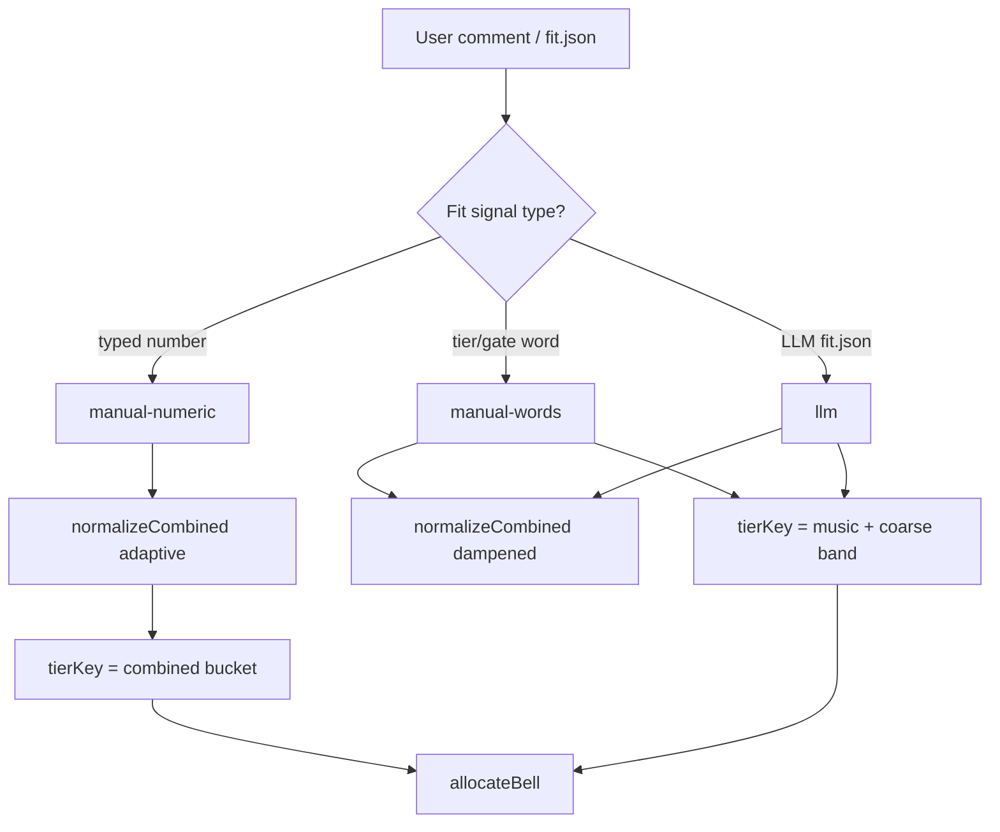

# Combined tier trust modes

## Problem (aaa-east)

Two mechanisms disagree:

- **Combined column** (sort): raw `0.5×fit + 0.5×music` on manual-fit parse — no normalization.
- **Same-tier rule** (`tierKey`): `effectiveMusic | coarseFit band` — KARMA `c:90|solid` vs Stone `c:77|excellent` despite both Combined **83.5**.

Result: B/C can put 4 vs 3 on songs the owner considers tied.

## Owner intent (refined)

When assigning **manual numeric** fit scores, the owner does **not** think about internal tier bands (solid/strong/excellent at 72/85/93). A manual **85 vs 86** crossing that boundary was **not intentional** — those should behave as nearly-identical.

**Coarse fit-band cutoffs should apply only when:**

1. **LLM** supplied the fit number (arbitrary / imprecise research scores), or
2. **Owner used tier words** in comments (`strong`, `pass`, `fit bonus`, second number with `--fit-words` semantics tied to vocabulary—not bare owner numerics).

**Manual numeric fit** → trust relative order and Combined; **no coarse band** in tier equality.

## Three fit-trust modes

| Mode | How detected | Combined score | Same-tier key (`tierKey`) |
|------|--------------|----------------|---------------------------|
| **manual-numeric** | `fitSource: 'manual'` and fit came from a **typed number** (incl. `76 95`, `8 fit`, peel-first second number)—not from tier-word vocabulary alone | `normalizeCombined`, **adaptive fit floor** (field std, min ≈ music floor 2) | **Quantized `rankValue`** (0.5 steps) — equal Combined ⇒ same votes |
| **manual-words** | `fitSource: 'manual'` and fit from **tier/gate/shorthand words** (`strong`, `pass`, `fit bonus`) | Same as llm path if merged; on parse-only may skip fit axis | **Unchanged:** `effectiveMusic \| coarseFit band` |
| **llm** | `fitSource: 'llm'` or fit.json merge | `normalizeCombined`, **fit floor 14** | **Unchanged:** `effectiveMusic \| coarseFit band` |



### Detection heuristic ([`scripts/score/comment.mjs`](scripts/score/comment.mjs))

Extend parse output (or derive at allocate time):

- **`fitKind: 'numeric' | 'words' | 'llm'`** on each song, set when scoring:
  - **numeric**: explicit `fit N` / `N fit`, peel-first second number, digit scaling—before tier-word synonym match assigns `fitTier` from vocabulary.
  - **words**: fit from `FIT_TIER_SYNONYMS`, `FIT_SHORTHAND`, or gate words with `--fit-words`.
  - **llm**: merge path only.

Round-level **`profile.fitTrust`**:

- `'manual-numeric'` if **any** contender has manual numeric fit (combined rounds).
- Else `'llm'` (includes manual-words-only and LLM rounds).

Mixed rounds (some manual numbers + LLM fill): **manual-numeric wins** for tierKey on the whole field so owner numbers are never silently snapped to LLM bands.

### Why not coarse bands for manual numbers

- Display `fitTier` label (snap for UI) can stay — it must **not** drive `tierKey` when `fitKind === 'numeric'`.
- Manual **85 vs 86** → different raw fit but often **same Combined bucket** after normalization; if Combined differs by &lt;0.5, same tier anyway.
- KARMA / Stone (90/77 vs 77/90) → same Combined → **same votes** (user-confirmed).

## Normalization contender pool (cutoff / DQ)

**Your question:** should `--cutoff fit:52` mean the z-score curve is fit only to songs **above** the cutoff?

**Merge / LLM path — already yes.** [`normalizeCombined`](scripts/score/merge.mjs) builds mean/stddev from **`isContender(s, gate)`** only:

- Excluded from the curve: `isDisqualified`, `needsUserInput`, below cutoff, gate `fail`.
- Included: songs that would actually compete for points.
- Below-cutoff songs still **receive** a `combinedScore` (computed with contender mean/stddev), but they do not **shape** the curve. Same intent as decision log 2026-06-16 (gated-out fit must not inflate fit std).

**Manual-fit parse path — not today.** [`applyManualFitScoring`](scripts/parse-round.mjs) uses raw `0.5×fit + 0.5×music` and **does not call** `normalizeCombined` or pass `profile.gate`. So aaa-east with `--cutoff fit:52` + manual numerics is **not** using a remaining-songs curve yet.

**Plan requirement:** when wiring `applyManualFitScoring` → `normalizeCombined`, **always pass `profile.gate`** (from `--cutoff` / `--gate`). Same `isContender` filter as merge. Verify with test: field with fit 40–95, cutoff 52 → mean/stddev computed from fit ≥ 52 only; sub-52 songs get Combined scores on that curve but earn 0 votes via allocator gate.

Canonical diagram: [`spec/diagrams/normalization-contender-pool.md`](../../spec/diagrams/normalization-contender-pool.md).


### 1. [`scripts/score/merge.mjs`](scripts/score/merge.mjs)

- `normalizeCombined(songs, weights, gate, { fitTrust })`
  - `manual-numeric`: `fitDenom = max(MUSIC_STD_FLOOR, stddev(fitVals))`
  - `llm` / `manual-words`: keep `FIT_STD_FLOOR = 14`
- `resolveFitTrust(songs)` from `fitKind` / `fitSource` fields.

### 2. [`scripts/parse-round.mjs`](scripts/parse-round.mjs)

- `applyManualFitScoring`: call `normalizeCombined(songs, combineWeights, profile.gate, { fitTrust: 'manual-numeric' })` — **gate required** so cutoff/DQ songs are excluded from curve stats.
- Set `profile.fitTrust`.

### 3. [`scripts/score/allocate.mjs`](scripts/score/allocate.mjs)

- `tierKey` combined branch:
  - `profile.fitTrust === 'manual-numeric'`: `'c:b:' + quantize(rankValue(s, profile), 0.5)`
  - else: `'c:' + effectiveMusic + '|' + coarseFit(s)` (existing)
- Update `describeTierGroup` for manual-numeric: `combined 83.5` not `music 90, fit solid band`.

### 4. [`scripts/score/comment.mjs`](scripts/score/comment.mjs)

- Set `fitKind: 'numeric' | 'words'` when parsing manual fit (track whether score came from word map vs digit).

### 5. Tests + spec

- KARMA/Stone equal votes with manual-numeric combined.
- Manual fit 85 vs 86: same tierKey bucket or adjacent Combined within same quantize step; **not** split by excellent vs strong band.
- **Cutoff + normalize:** `--cutoff fit:52` on manual-fit parse — contender pool excludes fit &lt; 52 from mean/stddev; sub-cutoff songs still get Combined for display but 0 votes.
- LLM / manual-words: existing `combined: equal music + same coarse fit band` test unchanged.
- Update [`spec/point-allocation.md`](spec/point-allocation.md) same-tier section; [`spec/decisions.md`](spec/decisions.md) entry.

## Verification

```bash
just parse --fit-words --cutoff fit:52   # aaa-east
```

KARMA and Stone Forest (Combined 83.5) → **matching** A/B/C columns.

```bash
npm test
```

## Out of scope

- Audit-only `combined-tier-split` tradeoff (user chose structural fix).
- Relaxing LLM band snapping (88 strong vs 90 excellent) unless requested after ship.
