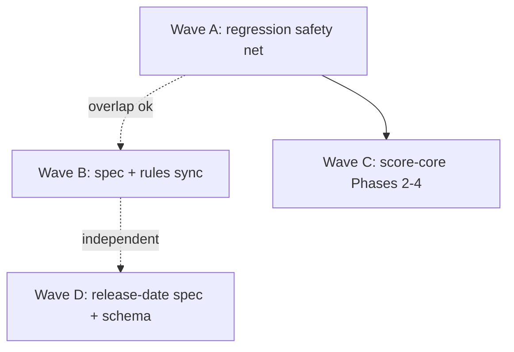

# Hands-off orchestrator

Knock out the deterministic, no-input work while the **Airtable merge**
([lastfm-airtable-artist-merge](lastfm-airtable-artist-merge.plan.md),
[release-date-airtable-sync](release-date-airtable-sync.plan.md)) and **Spotify creds**
(release-date fetch providers) wait on user input. This plan is pure ordering + gates over
existing child plans — it adds no new scope.

**Baseline (2026-07-08):** `npm test` = 203 passing, `just lint` clean. Every wave's gate
compares against this.

**Commit policy:** user granted commit-between-steps for this effort. One commit per wave
(or per phase within a wave). Add a `spec/decisions.md` entry when behavior/spec changes
land (not for test-only or docs-only unless a rule/spec contract changes). Per
[plan-lifecycle](../rules/plan-lifecycle.mdc): keep child plans until their waves ship,
then trim.

## Explicitly OUT of scope (needs user input — do not touch)

| Deferred | Blocker |
| --- | --- |
| Release-date **fetch providers** (Phase 2 of enrichment) | Spotify `SPOTIFY_CLIENT_ID/SECRET` + MusicBrainz `MB_CONTACT` decision |
| Release-date **CSV enrichment** (Phase 3) | Spotify search creds |
| **Airtable push/merge** (release-date-airtable-sync, lastfm-airtable-artist-merge) | Airtable access method not captured |

If a wave starts to require any of the above, **stop and report** rather than guessing.

## Dependency graph

Wave A **must** land before Wave C (Phase 2 renderer dedup needs the diff catch-net).
Waves B and D are independent and can run in any order relative to A/C.

---

## Wave A — Regression safety net ✅ shipped 2026-07-08

**Child plans:** [followup-5-specs-and-tests](followup-5-specs-and-tests.plan.md) (snapshot
section) + [improve-just-cli-and-docs](improve-just-cli-and-docs.plan.md) (Phase 3).
Master-plan **Wave 2**.

**Why first:** score-core Phases 2–4 and renderer dedup need a diff-based catch-net beyond
unit tests.

**Shipped:** `scripts/regression-snapshot.mjs` + `just test-regression`, `tests/ml.test.mjs`,
`tests/pipeline-e2e.test.mjs`, `tests/regression-snapshot.test.mjs`, baseline under
`tests/fixtures/sample-round/snapshot/`, and the `ML_DATA_DIR` test override in `paths.mjs`.
211 tests green. See `spec/decisions.md` (2026-07-08). Gate met.

### A1 — Output snapshot regression harness

- Add a repeatable snapshot+diff workflow: `just test-regression` (or a script under
  `scripts/` / `tests/regressions/`).
- Capture baseline artifacts (`music.json`, `music.md`, HTML) for active rounds + the
  `sample-round` fixture; regenerate and `diff -r` after a change.
- Also snapshot the `score-core.mjs` export list (`Object.keys(...).sort()`) for module-split
  parity checks (see split plan Phase 0).

### A2 — `tests/ml.test.mjs` (dispatcher)

- Cover `ml parse|merge|pick|final|status|run|help`: correct script per subcommand.
- Stage errors when prerequisites missing (e.g. `pick` without `music.json` → "parse first").
- Deprecated parse flags (`--fit`, `--option`, `--reason`) surface redirect messages.
- Mirror style of existing `tests/ml-status.test.mjs`. (`tests/extract-html.test.mjs` already
  exists — don't duplicate.)

### A3 — End-to-end fixture

- Beyond `tests/pipeline-stages.test.mjs` invariants: run `just parse` → `just pick` →
  `just final` on `sample-round`; assert artifacts exist and pick block present.
- Optional: thematic path with `merge`.

**Gate:**

- [ ] One command reproduces the snapshot diff workflow.
- [ ] `ml pick` without `music.json` fails with an actionable message (tested).
- [ ] `npm test` green (> 203) and `just lint` clean.

**Commit:** "Add regression snapshot harness + dispatcher/e2e tests" (may split A1 vs A2/A3).

---

## Wave B — Spec & rules sync

**Child plan:** [followup-5-specs-and-tests](followup-5-specs-and-tests.plan.md) (spec slice).
Master-plan **Wave 3**. Pure docs — no code behavior change.

- [ ] `spec/round-input-parsing.md` (new): schema-first HTML selectors; text rules; the
      user-vs-submitter scoring contract (`userComment` sole scoring source).
- [ ] `spec/score-parsing.md` — fill any gaps beyond the Wave 1 contract (owner guide already
      in `spec/scoring-comments.md`).
- [ ] `spec/fit-evaluation.md`, `spec/comments.md` — reconcile with current code.
- [ ] `.cursor/rules/parsing.mdc`, `output.mdc`, `allocation.mdc` — refresh to match shipped
      behavior.
- [ ] Regression prose fixture (`tests/regressions/006.md` or successor) over the sample round.

**Gate:** A fresh agent session can implement parse/allocation behavior from `spec/` alone,
without reading plan files.

**Commit:** "Sync specs + rules with shipped pipeline behavior" (+ `spec/decisions.md` entry
for any contract clarification).

---

## Wave C — score-core Phases 2–4

**Child plan:** [split-score-core-into-modules](split-score-core-into-modules.plan.md)
Phases 2–4. Master-plan **Wave 4**. **Prerequisite: Wave A green** (snapshot diff clean
before and after each phase).

| Phase | Work | Verify | Status |
| --- | --- | --- | --- |
| 2 | Extract shared HTML renderer helpers from `render-fit-html.mjs` / `render-final-html.mjs`; import `formatScore` / `fitTierForScore` from the barrel | snapshot diff clean | ✅ shipped `c253abb` |
| 3 | Split `tests/score.test.mjs` → `comment` / `allocate` / `merge` test files | `npm test` same total | pending |
| 4 | Export `normalizeDownShape` from `allocate.mjs` (delegate `parseDownShape`); export `OPTION_LETTERS` from `render.mjs` (import in `render-html-shared.mjs`, `round/pick.mjs`) | `npm test` same count | ✅ shipped 2026-07-08 |

Constraint: keep `scripts/score/*` free of `node:*` imports (browser-importable). Importers
keep using `./score-core.mjs`.

**Gate (per phase):** `npm test` same count; snapshot diff clean; **no _new_ eslint errors**.
Note: `just lint` currently has 12 **pre-existing** errors from other committed work
(`release-year-gate.mjs` no-undef for `fetch`/`Buffer`/`setTimeout` — the in-flight
release-date track — plus a handful of unused-var warnings in `cli-commands.mjs`,
`ml.mjs`, `allocate.mjs`, `ml-config.test.mjs`). Phases 2 and 4 added none; full
`just lint` clean is blocked on the release-date file and left for the user.

**Commit:** one per phase; `spec/decisions.md` entry per phase that lands.

---

## Wave D — Release-date enrichment (Phase 1 only)

**Child plan:** [release-date-enrichment](release-date-enrichment.plan.md) **Phase 1 only**.
Independent of A–C. This is the hands-off slice of the urgent release-date work; the fetch
providers (Phase 2) and CSV enrichment (Phase 3) are OUT of scope (Spotify creds).

- [ ] Write `spec/release-dates.md`: the two-date model (earliest-release vs specific-album),
      `albumEdition` vocab (`standard | deluxe | repackage | reissue | compilation`), the
      bonus-track rule, confidence levels (`verified | album-date | fuzzy | needs-review`),
      and a no-grep-JSON note (mirror `no-grep-csvs.mdc`).
- [ ] Version the `data/ref/release-dates.json` shape: keep `_doc`, document fields, and
      reserve a second key space for id-less rows (normalized `artist|title` → record with
      per-album sub-entries). Schema/doc only — no live fetching.

**STOP** after Phase 1. Do not start Phase 2 (`--fetch` live test) — it needs the creds
decision. Report back that Phase 2/3 remain gated on Spotify creds.

**Gate:** `spec/release-dates.md` exists and matches the shipped `release-year-gate.mjs`
cache fields; bg-2016 offline gate still 14 pass / 2 fail (no code change, so this is a
sanity re-run).

**Commit:** "Add release-date spec + cache schema doc". `data/` is a submodule — if the
`release-dates.json` `_doc` changes, follow [data-submodule-sync](../rules/data-submodule-sync.mdc)
(commit/push `data` before the parent pointer).

---

## Done criteria

- [ ] Waves A, B, D shipped; Wave C shipped or explicitly deferred.
- [ ] `npm test` green, `just lint` clean.
- [ ] Child plans trimmed/deleted per plan-lifecycle; open items moved to `future-plans`.
- [ ] `remaining-work-master` Waves 2–4 checkboxes updated.
