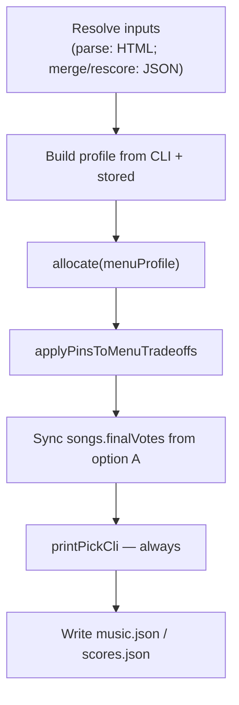

# Menu-wide pin reflow + consistent explore tables

## Problems

1. **`--pin` on explore commands** only affects the committed ballot at `just pick <option> --pin …`. `rescore` silently ignores `--pin`; parse/merge don't reflow the A–E option columns.

2. **`parse --weights` (and similar knobs) skip updated tables** — on thematic rounds especially, `parse` re-reads HTML only and never loads `fit.json`, so `--weights`/`--rank`/`--gate` don't re-blend combined scores. The user sees file-write lines but no refreshed Up/Down/Ballot tables (or tables that don't reflect the knob change). The intended workflow says those flags live on **merge/rescore**, but the CLI also advertises them on parse — behavior must match expectation: **any explore command that changes profile knobs prints the full updated tables**.

## Desired behavior

```bash
just rescore --pin 8:1,5:1     # every A–E column honors pins; Ballot synced
just parse --weights 5:5       # thematic: re-blend from fit.json, print tables
just merge --pin 8:1,5:1        # same reflowed menu
just pick A --dry-run          # full menu + applied preview
```

Pins reflow **existing** options (shortcut: run `reconcileOptionPins` on each option as if `pick <letter> --pin …` had been applied). Up **and** down pins apply to their respective menus.

## Architecture: shared `exploreRound()`

New helper (e.g. [`scripts/round/explore.mjs`](scripts/round/explore.mjs)) used by parse, merge, rescore:



**Rules:**

- **`menuProfile`** strips overrides/downOverrides for menu generation (existing pattern in [`pick-round.mjs`](scripts/pick-round.mjs)); pins applied post-hoc via reflow.
- **`printPickCli` always runs** after explore when budget > 0 and scored songs exist. If no `tier-structure` tradeoff would render, treat as bug (regression guard / loud warning).
- **`pick --dry-run`** calls the same reflow + `printPickCli` before the applied preview.

### parse + thematic rounds

When `fit.json` exists **and** the caller passes merge-stage knobs (`--weights`, `--rank`, `--gate`, `--cutoff`), parse should:

1. Still parse HTML → update `music.json` (music scores from export).
2. Run **`mergeFitJson`** with the new profile (same as merge/rescore) for allocation + tables.
3. Write/update `scores.json` so the blended state persists (or at minimum print merged tables — prefer writing `scores.json` to keep artifacts in sync).

Without `fit.json`, `--weights` only applies when manual fit exists in comments (current `applyManualFitScoring` path) — document this, but tables still print.

## New helper: `applyPinsToMenuTradeoffs`

Add to [`scripts/round/pick.mjs`](scripts/round/pick.mjs) (exported, tested):

1. **`tier-structure` (up pins)** — `reconcileOptionPins(opt.perSong, overrides, upCap)` per option; recompute `shape` + label.
2. **`down-structure` (down pins)** — `reconcileDownOptionPins` (mirror logic: shed from best-ranked funded, promote worst unfunded first).
3. **Dedup** collapsed options; CLI note when options merge.
4. **Budget guard** — warn if reconcile can't balance an option.
5. **Ballot preview sync** — set `finalVotes` / `finalDownvotes` from option A's reflowed split.

## Command wiring

| Command | Change |
|---------|--------|
| [`parse-round.mjs`](scripts/parse-round.mjs) | Use `exploreRound`; auto-merge path when `fit.json` + blend flags |
| [`merge-scores.mjs`](scripts/merge-scores.mjs) | Use `exploreRound` |
| [`rescore-round.mjs`](scripts/rescore-round.mjs) | Add `--pin`; use `exploreRound`; warn on unknown flags |
| [`pick-round.mjs`](scripts/pick-round.mjs) | Reflow menu before pick; `--dry-run` prints full tables |

Pick commit path unchanged: `applyOptionPick` is idempotent when option was pre-reflowed.

## Persistence

Extend [`slimProfile`](scripts/parse/pipeline.mjs) to persist `overrides`, `downOverrides`, and `weights` when set:

```bash
just rescore --pin 8:1,5:1
just pick D    # inherits stored pins
```

Re-run without `--pin` clears stored overrides. Tradeoffs in JSON carry reflowed `perSong` → HTML/markdown stay consistent.

## Docs / spec

- [`spec/point-allocation.md`](spec/point-allocation.md) — menu-wide pin reflow; explore commands always print tables; parse auto-merge when fit.json present.
- [`scripts/cli-help.mjs`](scripts/cli-help.mjs) — `--pin` on rescore; clarify parse vs merge vs rescore for weights.
- [`spec/decisions.md`](spec/decisions.md) — log on ship.

## Tests

- Pin reflow: all options honor `{8:1, 5:1}`, budget exact (up + down).
- Dedup when pins collapse options.
- Idempotent pick on pre-reflowed option.
- **parse --weights on fixture with fit.json** → stdout includes Up table with updated Combined ordering.
- **explore guard**: scored field + budget → tier-structure menu always present.
- rescore `--pin` e2e.

## Out of scope

- Pins don't regenerate new tier-structure candidates — they reflow existing ones.
- `--tier-count` / `--bucket-count` forced modes unchanged.
- `pinEligibilityError` stays on pick commit only.

## Example

```bash
just rescore --pin 8:1,5:1
# Up: every column shows #8=1, #5=1; others reflowed per option shape
just pick E --reason "graduated top, both low songs at 1"
```
