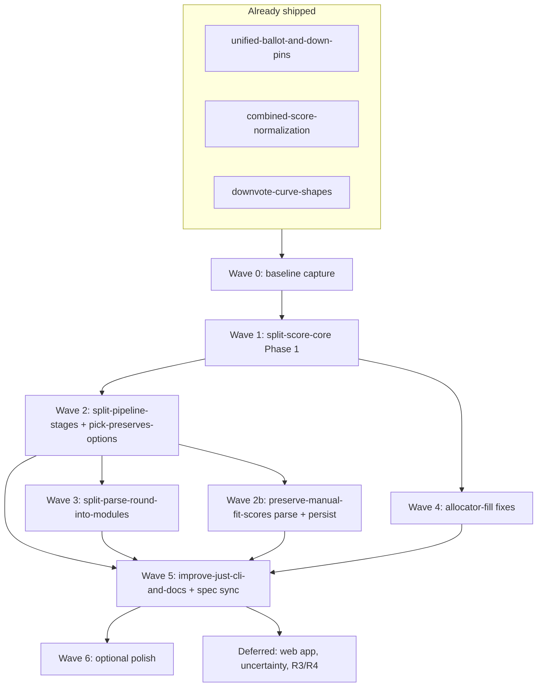

# Master plan: pipeline cleanup & JS refactors

Orchestrates the structural work discussed in 2026-06. Each child plan stays the
source of detail; this file is **order, gates, and scope** only.

## Goals

1. **Three-stage pipeline** — parse (HTML→JSON), merge (JSON+JSON), pick (JSON-only).
2. **Pick audit trail** — full A/B/C menu preserved for training, never coupled to HTML re-read.
3. **Discoverable CLI** — `just parse` / `merge` / `pick` / `final` + `ml help`.
4. **Maintainable JS** — `score-core` and `parse-round` split into focused modules without behavior drift.
5. **Specs/tests match reality** — after shapes settle.

## Plan inventory

| Plan | Status | Role in master sequence |
| --- | --- | --- |
| [split-score-core-into-modules](split-score-core-into-modules.plan.md) | pending | **Wave 1** — mechanical split of 2296-line core |
| [split-pipeline-stages](split-pipeline-stages.plan.md) | pending | **Wave 2** — parse / merge / pick scripts |
| [pick-preserves-options](pick-preserves-options.plan.md) | pending | **Wave 2** — pick invariants + render fixes |
| [preserve-manual-fit-scores](preserve-manual-fit-scores.plan.md) | pending | **Wave 2b–3** — parsing + pure render (overlaps pipeline) |
| [split-parse-round-into-modules](split-parse-round-into-modules.plan.md) | pending | **Wave 3** — slim parse module layout |
| [allocator-fill-and-maybe-funding-fixes](allocator-fill-and-maybe-funding-fixes.plan.md) | pending | **Wave 4** — allocator behavior (R1 center-out + maybe funding) |
| [center-out-smooth-allocation](center-out-smooth-allocation.plan.md) | pending | **Absorbed** into allocator-fill (origin doc only) |
| [improve-just-cli-and-docs](improve-just-cli-and-docs.plan.md) | pending | **Wave 5** — just/ml help, README, status |
| [followup-5-specs-and-tests](followup-5-specs-and-tests.plan.md) | pending | **Wave 5–6** — spec sync + harness (partially done via existing tests) |
| [unified-ballot-and-down-pins](unified-ballot-and-down-pins.plan.md) | done | Prerequisite shipped |
| [combined-score-normalization](combined-score-normalization.plan.md) | done | — |
| [downvote-curve-shapes](downvote-curve-shapes.plan.md) | done | — |
| [followup-4-allocation-presets](followup-4-allocation-presets.plan.md) | done | — |
| [web-app-and-allocation-engine](web-app-and-allocation-engine.plan.md) | partial | **Deferred track** — after Waves 1–5 |
| [future-plans](future-plans.plan.md) | living | Items #7–8 fold into Wave 5; allocator R3/R4 stay deferred |
| [uncertainty-band-allocation](uncertainty-band-allocation.plan.md) | pending | **Deferred** — not on critical path |
| [followup-3-thematic-mode](followup-3-thematic-mode.plan.md) | pending | **Deferred** — agent loop largely exists |

## Dependency graph



## Waves (execution order)

### Wave 0 — Baseline & gates (1 session)

**Purpose:** Any refactor diff that changes output is caught immediately.

From [split-score-core-into-modules](split-score-core-into-modules.plan.md) Phase 0:

- [ ] `npm test` + `just lint` — record pass counts
- [ ] Export snapshot: `score-core.mjs` public API → `/tmp/ml-exports-before.txt`
- [ ] Golden outputs for active rounds (parse, merge where fit exists, render) → `/tmp/ml-before`

**Gate:** baseline captured before Wave 1 touches `score-core`.

---

### Wave 1 — Split `score-core` (mechanical, no logic changes)

**Plan:** [split-score-core-into-modules](split-score-core-into-modules.plan.md) Phase 1 only.

- [ ] Create `scripts/score/{format,fit-signal,comment,allocate,merge,render}.mjs`
- [ ] `score-core.mjs` → re-export barrel
- [ ] Zero importer churn (`parse-round`, renderers, tests still import barrel)

**Gate (all required):**

- Export parity vs Wave 0 snapshot
- `npm test` — same pass count
- Golden `diff -r /tmp/ml-before analysis` — **no differences**
- `scripts/score/*` — no `node:fs` / `node:path` (browser-safe)

**Do not start Wave 2 until green.** Allocator behavior changes (Wave 4) land in
`scripts/score/allocate.mjs` *after* this split.

Optional later (Wave 6): Phases 2–4 of score-core plan (renderer dedup, test file split, `OPTION_LETTERS` dedup).

---

### Wave 2 — Pipeline stage separation + pick preservation

**Plans:** [split-pipeline-stages](split-pipeline-stages.plan.md) + [pick-preserves-options](pick-preserves-options.plan.md)

**New scripts / behavior:**

| Deliverable | Detail |
| --- | --- |
| `merge-scores.mjs` | `music.json` + `fit.json` → `scores.json`; **no HTML** |
| `pick-round.mjs` | JSON-only `--option` / `--reason` / `--pin`; writes `pick` + `picks.jsonl` |
| Slim `parse-round.mjs` | HTML → `music.json` only; **remove** `--fit`, `--option`, `--reason` |
| `ml.mjs` | `merge`, `pick` subcommands; deprecate old parse flags |
| Pick render fixes | `renderPickMarkdown`, combo ballot from `pick.options` (P3–P4) |
| Profile snapshot | Optional `profile` in JSON so pick replays same menu |

**Ownership rules (non-negotiable):**

- Parse never writes `pick`
- Pick never reads HTML
- Merge never picks

**Tests:**

- [ ] Stage isolation tests (pick doesn't open `.html`)
- [ ] Pick preserves full `options[]` (P1, P5)
- [ ] Parse output has no `pick` field

**Gate:** end-to-end on sample-round / one real round:

```bash
just parse X → just pick X A --reason "…" → just merge X (if thematic) → just final X
```

Docs stub OK here; full docs in Wave 5.

---

### Wave 2b — Manual fit scores (parse + persist slice)

**Plan:** [preserve-manual-fit-scores](preserve-manual-fit-scores.plan.md) — **first half only**, aligned with new stages.

| Todo cluster | Wave 2b | Defer |
| --- | --- | --- |
| `parse-grammar`, `word-gating`, `flag-plumbing` | ✓ | |
| `persist-fields`, `alloc-combined` | ✓ | |
| `pure-render` | ✓ — **required**: renderers stop calling `mergeFitJson` / re-scoring | |
| `tests`, `docs-decisions` | partial | full spec pass → Wave 5 |

**Why here:** `pure-render` is the same principle as split-pipeline-stages (allocate in parse/merge only). Doing it before Wave 3 avoids moving render-coupled code twice.

**Gate:** `render-final-html.mjs` reads persisted JSON only; no `--fit` re-merge in render path.

---

### Wave 3 — Split slim `parse-round`

**Plan:** [split-parse-round-into-modules](split-parse-round-into-modules.plan.md)

- [ ] `scripts/parse/{cli-flags,cli-print}.mjs` — parse entry only
- [ ] `scripts/round/pick.mjs` (or keep in `pick-round.mjs`) — shared with pick CLI
- [ ] **Not** in parse pipeline: `applyOptionPick`, `recordPickToTrainingLog` (live in pick stage)

**Gate:** `parse-round.mjs` < ~200 lines entry + imports; pick/merge untouched; tests green.

---

### Wave 4 — Allocator behavior fixes

**Plans:** [allocator-fill-and-maybe-funding-fixes](allocator-fill-and-maybe-funding-fixes.plan.md) (primary); [center-out-smooth-allocation](center-out-smooth-allocation.plan.md) = design origin only.

**Order inside wave (from allocator-fill plan):**

1. **Bug 2** — maybe-band funding order (`passFailMaybe`)
2. **Bug 1 / R1** — center-out unit-step staircase (replaces waterfill-first top-heaviness)
3. **R2** — ≥80 favorite-band merge (if not already complete)

**Touch:** `scripts/score/allocate.mjs` only (post Wave 1).

**Gate:**

- [ ] kpop-solo regression case — no `{4,1,0}` skip; smooth steps
- [ ] maybe never beats clear pass
- [ ] Golden diff on affected rounds OR new regression fixtures
- [ ] `npm test` green

**Not in this wave:** R3/R4 semantic anchors / variance compression ([future-plans](future-plans.plan.md)).

---

### Wave 5 — Documentation, CLI polish, specs

**Plans:** [improve-just-cli-and-docs](improve-just-cli-and-docs.plan.md) + [followup-5-specs-and-tests](followup-5-specs-and-tests.plan.md) (sync slice)

| Deliverable | Source |
| --- | --- |
| README three-stage workflow | improve-just-cli |
| `just` recipe doc comments | improve-just-cli |
| `ml help parse\|merge\|pick\|final` | improve-just-cli |
| `just status` pick row + next steps | improve-just-cli |
| `music-league-workspace` skill | improve-just-cli |
| `spec/analysis-artifacts.md` — stage ownership | pick-preserves + pipeline |
| `spec/point-allocation.md` — pick invariants, deprecated parse flags | pick-preserves |
| `spec/decisions.md` — one entry per shipped wave | all |
| `data/analysis/README.md` — `picks.jsonl` | improve-just-cli |

**Gate:** README answer card works without reading plan files; `just --list` self-explanatory.

---

### Wave 6 — Optional polish (when bandwidth allows)

- [ ] split-score-core Phases 2–4 (renderer dedup, test file split)
- [ ] preserve-manual-fit-scores remaining docs/tests if not closed in 2b
- [ ] `tests/ml.test.mjs` dispatcher coverage
- [ ] Golden harness formalized (followup-5)
- [ ] Review `scripts/one-off/` for fold-in candidates ([future-plans](future-plans.plan.md) #18)

---

## Deferred track (after Wave 5 stable)

| Work | Why wait |
| --- | --- |
| [web-app-and-allocation-engine](web-app-and-allocation-engine.plan.md) / followup-2 | Needs stable `scripts/score/*` imports + stage-separated JSON contract |
| [uncertainty-band-allocation](uncertainty-band-allocation.plan.md) | Allocator semantics still moving in Wave 4 |
| [followup-3-thematic-mode](followup-3-thematic-mode.plan.md) | Agent fit loop exists; not blocked by CLI split |
| future-plans R3/R4 | Only if Wave 4 rounds still show gaps |
| future-plans #19 post-draft tweak scripts | After CLI flags documented (Wave 5) |
| future-plans #20 music-only multi-option UX | Separate product decision |

---

## Parallelism (what can overlap)

| Can run in parallel | Must stay sequential |
| --- | --- |
| Wave 0 baseline while drafting Wave 2 scripts | Wave 2 before Wave 3 (parse slim first) |
| Wave 5 README drafts during Wave 2 impl | Wave 1 before Wave 4 (allocate module exists) |
| Wave 2b parse-grammar while Wave 2 pick script | Wave 2 before Wave 5 final docs (flags stabilize) |

**Recommended single-threaded path for one implementer:**

```text
W0 → W1 → W2 (+ pick-preserves) → W2b → W3 → W4 → W5 → W6
```

---

## Verification checklist (master done)

- [ ] `just parse` never accepts `--fit` / `--option` (or warns then removed)
- [ ] `just pick` never reads `data/rounds/*.html`
- [ ] `just merge` never reads HTML
- [ ] Pick recorded → `pick.options` has all rejected alternatives
- [ ] `music.md` shows Options considered after pick
- [ ] `picks.jsonl` one row per round, full options array
- [ ] Renderers pure (no allocate/merge in HTML path)
- [ ] `score-core` split with export parity
- [ ] README + `ml help` document all stages
- [ ] `npm test` && `just lint` green

---

## Child plan status tracking

Update this table as waves complete (newest change at top):

| Wave | Plan | Status |
| --- | --- | --- |
| — | pipeline-cleanup-master | pending |
| 0–1 | split-score-core-into-modules | pending |
| 2 | split-pipeline-stages | pending |
| 2 | pick-preserves-options | pending |
| 2b | preserve-manual-fit-scores | pending |
| 3 | split-parse-round-into-modules | pending |
| 4 | allocator-fill-and-maybe-funding-fixes | pending |
| 5 | improve-just-cli-and-docs | pending |
| 5 | followup-5-specs-and-tests | pending |
| 6+ | split-score-core Phases 2–4 | optional |
| defer | web-app-and-allocation-engine | blocked on W1+W2+W5 |

---

## Quick reference: normal user flow (target end state)

```bash
# Music-only — parse once after voting complete
just parse my-round
just pick my-round B --reason "flatter split"
just final my-round

# Thematic
just parse my-round
# … agent writes fit.json …
just merge my-round
just pick my-round C --reason "thematic standouts"
just final my-round
```

Re-parse (`just parse`) only when replacing the HTML export; pick is always a separate JSON step.
