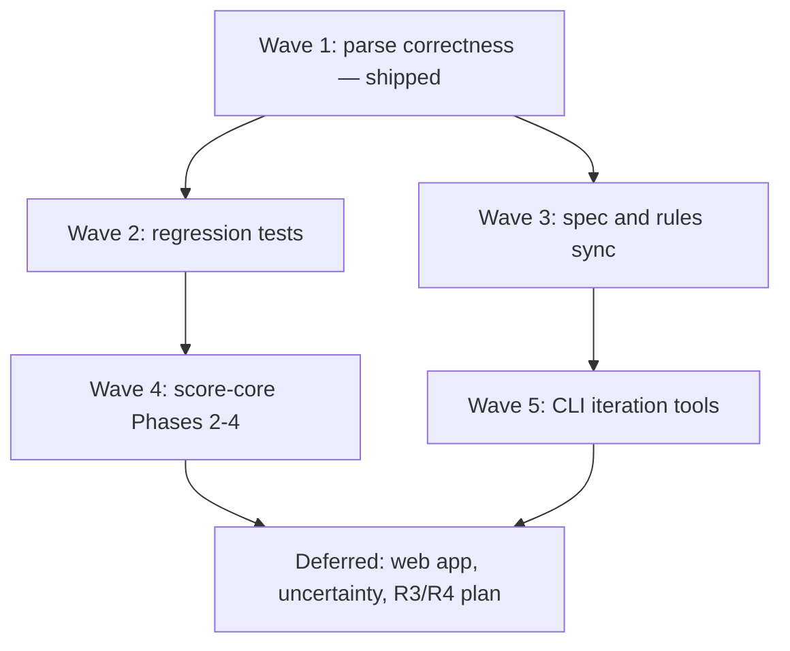

# Master plan: remaining high-value work

Picks up after the closed pipeline-cleanup effort (parse / merge / pick, score-core
Phase 1, CLI docs). Living backlog without a dedicated plan:
[future-plans.plan.md](future-plans.plan.md).

## Goals

1. ~~**Stop parse misreads**~~ — shipped 2026-06-27 (peel-first + `--fit-words`).
2. **Regression safety** — diff-based output snapshots + dispatcher tests before refactors.
3. **Specs match code** — agents and future-you read `spec/` not git history.
4. **Safe mechanical cleanup** — score-core Phases 2–4 only after tests exist.
5. **Faster round iteration** — post-draft tweak flags when pain recurs.

## Plan inventory

| Plan | Status | Role |
| --- | --- | --- |
| ~~preserve-manual-fit-scores~~ | **shipped** 2026-06-27 | Wave 1 — peel-first parse, `--fit-words` |
| [followup-5-specs-and-tests](followup-5-specs-and-tests.plan.md) | partial | **Waves 2–3** — specs, extract tests, snapshot regression |
| [improve-just-cli-and-docs](improve-just-cli-and-docs.plan.md) | partial | **Wave 2** — `ml.test`, e2e fixture |
| [split-score-core-into-modules](split-score-core-into-modules.plan.md) | partial | **Wave 4** — renderer dedup, test split, helper dedup |
| [future-plans](future-plans.plan.md) | living | **Wave 5** backlog |
| [deferred-allocation-r3-r4](deferred-allocation-r3-r4.plan.md) | deferred | **May not ship** — R3/R4 allocator refinements |
| [web-app-and-allocation-engine](web-app-and-allocation-engine.plan.md) | partial | **Deferred** — [followup-2](followup-2-web-app-mobile.plan.md) |
| [followup-3-thematic-mode](followup-3-thematic-mode.plan.md) | pending | **Deferred** — agent loop largely exists |
| [uncertainty-band-allocation](uncertainty-band-allocation.plan.md) | pending | **Deferred** — not blocking daily use |

## Dependency graph



## Waves (execution order)

### Wave 1 — Parse correctness ✅ shipped 2026-06-27

Peel-first comment parsing, `--fit-words` gating, `tests/comment-parse.test.mjs`,
`spec/score-parsing.md`, owner guide `spec/scoring-comments.md`. Plan file deleted
per plan lifecycle; see `spec/decisions.md` (2026-06-27 entries).

**Gate (met):**

- [x] Contract rows reviewed — `76 fit bonus` → music 76 + strong shorthand
- [x] All contract tests pass with `fitWords: false` default
- [x] `--fit-words` enables tier/gate vocabulary per contract
- [x] `npm test` green (134 tests)

---

### Wave 2 — Regression test safety net

**Plans:** [followup-5](followup-5-specs-and-tests.plan.md) (snapshot section) +
[improve-just-cli-and-docs](improve-just-cli-and-docs.plan.md) (Phase 3)

**Why before refactors:** score-core Phases 2–4 and renderer dedup need a diff-based
catch net beyond unit tests.

**Deliverables:**

| Item | Detail |
| --- | --- |
| Output snapshot regression test | Repeatable baseline + `diff` — `just test-regression` or script under `tests/regressions/` |
| `tests/ml.test.mjs` | Dispatcher + "parse first" stage errors |
| E2e fixture | parse → pick → final on sample round |
| `tests/extract.test.mjs` | HTML → counts, own-skip (if not already present) |

**Gate:**

- [ ] One command reproduces snapshot diff workflow
- [ ] `ml pick` without `music.json` fails with actionable message (tested)
- [ ] `npm test` green

---

### Wave 3 — Spec and rules sync

**Plan:** [followup-5-specs-and-tests](followup-5-specs-and-tests.plan.md) (spec slice)

**Deliverables:**

- [ ] `spec/round-input-parsing.md` (new)
- [ ] `spec/score-parsing.md` — complete (Wave 1 landed core contract; owner guide in `spec/scoring-comments.md`)
- [ ] `spec/fit-evaluation.md`, `spec/comments.md` — aligned with code
- [ ] `.cursor/rules/parsing.mdc`, `output.mdc`, `allocation.mdc` — refresh
- [ ] `tests/regressions/006.md` or successor prose fixture

**Gate:** A new agent session can implement parse/allocation behavior from `spec/`
alone without reading plan files.

---

### Wave 4 — Score-core optional cleanup

**Plan:** [split-score-core-into-modules](split-score-core-into-modules.plan.md) Phases 2–4

**Prerequisite:** Wave 2 snapshot regression test green before and after each phase.

| Phase | Work |
| --- | --- |
| 2 | De-dupe `render-fit-html` / `render-final-html` shared helpers |
| 3 | Split `tests/score.test.mjs` by module |
| 4 | `normalizeDownShape` + `OPTION_LETTERS` dedup |

**Gate:** `npm test` same count; snapshot diff clean per phase.

---

### Wave 5 — Daily-use CLI polish

**Source:** [future-plans](future-plans.plan.md) items 5–6

Pick up when a round exposes repeated manual pain:

- Post-draft tweak flags/scripts (compress curve, flatten, manual cutoff)
- Music-only multi-option UX (proper A/B/C menu without duplicate tables)

**Gate:** At least one real round uses the new flag/script instead of a one-off.

---

## Deferred track

Work **not** on the active path. Some may never ship.

### Allocator R3 / R4 (may never implement)

**Plan:** [deferred-allocation-r3-r4](deferred-allocation-r3-r4.plan.md)

R1 + R2 + Bug 2 shipped 2026-06-16. R3 (semantic 75/80 **funded floors**) and R4
(variance-aware gap compression) stay deferred until a **specific real round** fails
with existing knobs and the failure matches that doc. R4 is likely redundant with R1.

Do **not** schedule these on a wave; do **not** implement preemptively.

### Other deferred

| Work | Why wait |
| --- | --- |
| [web-app / followup-2](followup-2-web-app-mobile.plan.md) | Large; Wave 1–3 stabilize JSON contract and specs first |
| [followup-3-thematic-mode](followup-3-thematic-mode.plan.md) | Agent fit loop works via skills + manual `fit.json` |
| [uncertainty-band-allocation](uncertainty-band-allocation.plan.md) | Allocator stable; `?` band is refinement |
| `scripts/one-off/` fold-in review | Opportunistic during Wave 5 or when touching related code |

---

## Recommended path (single implementer)

```text
W1 → W2 → W3 → W4 (optional) → W5 (as needed)
```

W2 and W3 can overlap slightly (spec writing while tests land), but **do not start
Wave 4 until Wave 2 snapshot test exists**.

---

## Verification checklist (master done)

- [x] `--fit-words` default-off; peel-first parse grammar
- [ ] Output snapshot regression test repeatable
- [ ] `tests/ml.test.mjs` + e2e fixture green
- [ ] Core specs (`round-input-parsing`, `score-parsing`, `point-allocation`) current
- [ ] `npm test` && `just lint` green
- [ ] Partial child plans deleted or marked done; open items only in `future-plans`

---

## Child plan tracking

| Wave | Plan | Status |
| --- | --- | --- |
| — | remaining-work-master | in_progress |
| 1 | preserve-manual-fit-scores | **shipped** (plan deleted) |
| 2 | followup-5-specs-and-tests | partial (test slice) |
| 2 | improve-just-cli-and-docs | partial (Phase 3) |
| 3 | followup-5-specs-and-tests | partial (spec slice) |
| 4 | split-score-core-into-modules | partial (Phases 2–4) |
| 5 | future-plans items 5–6 | backlog |
| defer | deferred-allocation-r3-r4 | deferred (may not ship) |
| defer | web-app, followup-3, uncertainty | blocked |
