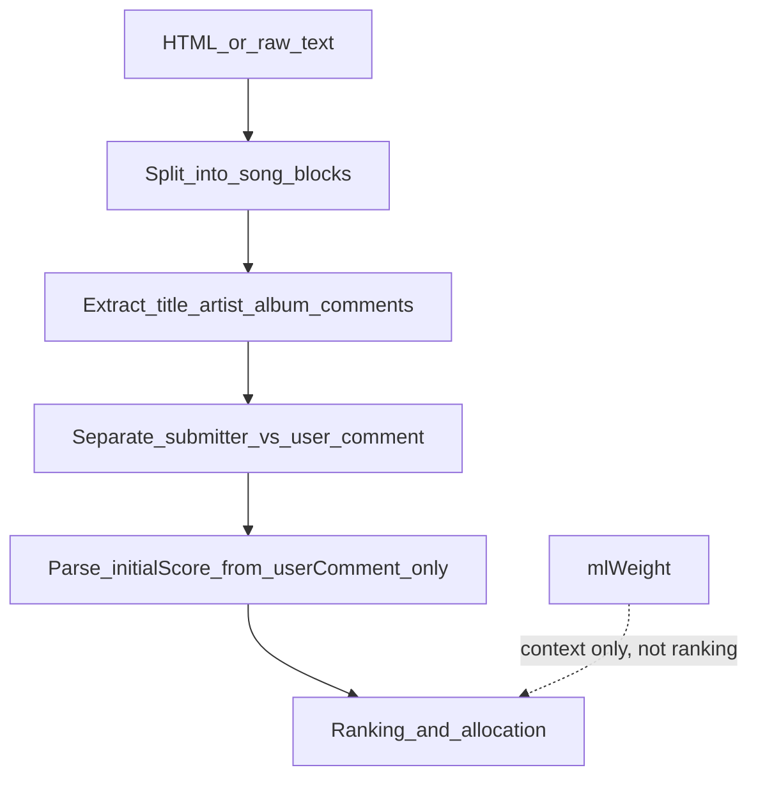

# Round Input Parsing Spec

## Problem

Parsing guidance today is split and incomplete:

- [`spec/score-parsing.md`](spec/score-parsing.md) covers **notation** (755 → 75.5) but not **where** scores live in input.
- [`spec/comments.md`](spec/comments.md) distinguishes submitter vs user comments conceptually but gives no field-level extraction rules.
- [`.cursor/rules/parsing.mdc`](.cursor/rules/parsing.mdc) repeats score notation only.

The sample round [`rounds/2026-06-06-aaa-logo.html`](rounds/2026-06-06-aaa-logo.html) / [`.txt`](rounds/2026-06-06-aaa-logo.txt) shows the real structure agents must handle, including the common failure mode of treating `data-weight` (ML upvote count) as a ranking score, or merging submitter and user comment blocks.

## Proposed structure

Create **[`spec/round-input-parsing.md`](spec/round-input-parsing.md)** as the canonical input-mapping spec. Keep score notation in [`spec/score-parsing.md`](spec/score-parsing.md) unchanged.

Update **[`.cursor/rules/parsing.mdc`](.cursor/rules/parsing.mdc)** with a short preamble: parse round input into fields first, then apply score notation rules to **user comment only**.

Cross-link from [`spec/comments.md`](spec/comments.md) (one line pointing to the new spec for ownership/disambiguation).

Optional one-line pointer in [`README.md`](README.md) under workflow step 2.

## Per-song output model

Each song block should normalize to:

| Field | Purpose |
|---|---|
| `title` | Track name |
| `artist` | Performing artist |
| `album` | Album name (metadata; not used as title) |
| `isOwnSubmission` | User submitted this entry |
| `mlWeight` | Platform upvote/downvote integer — **not** ranking score |
| `submitterComment` | Quote block from submitter |
| `userComment` | Voter's textarea notes |
| `initialScore` | Numeric score parsed from `userComment` via score-parsing rules |

## HTML mapping (preferred source)

Anchor each song on `div.song` (e.g. `#song-0`).

| Field | Selector / signal |
|---|---|
| `title` | `h6.mb-0.text-truncate` (purple track name) |
| `artist` | First `span.d-block.text-truncate` in the metadata row |
| `album` | Adjacent `span.text-body-secondary` |
| `mlWeight` | `data-weight` on `div.song` |
| `userComment` | `data-comment` on `div.song` (primary); fallback to `textarea[name="comment"]` body if populated |
| `submitterComment` | Non-empty text in `span.ws-pre-wrap` inside the quoted `
` with `bi-quote` icon, when that block is visible (`x-show="true"`) |
| `isOwnSubmission` | `mine: true` in `x-data`, or visible card-header text `You submitted this song` |
| `spotifyUri` | `input[name="uri"]` (optional dedup key) |

**Hard disambiguation rules to document:**

- `data-comment` is always the **user** comment, never the submitter quote.
- Submitter text lives only in the quote `
`, e.g. BUGY CRAXONE: submitter = `"they change their logo a lot..."`, user = `"As far as I can tell, that's not a logo..."`.
- Do **not** parse ranking scores from `data-weight`, `h2` weight display, or submitter comments.

## Raw text mapping (fallback)

Song blocks begin at a line exactly matching `Album art`.

Within each block, read in order:

1. Optional marker line: `You submitted this song` → `isOwnSubmission = true`
2. `Album art` (delimiter; discard)
3. Line 1 → `title`
4. Line 2 → `artist`
5. Line 3 → `album`
6. Next line → `mlWeight` **if** it is a standalone integer; skip if absent (own-submission copies often omit it — see ONEUS block in sample txt)
7. Skip placeholder lines: `What did you think of this song?` / `What did you think of your own song?`
8. Comment region until `\d+ / 1000` char-count footer:
   - **One** non-empty text block → `userComment`
   - **Two** blocks separated by blank lines → first = `submitterComment`, second = `userComment` (IVE and BUGY CRAXONE patterns in sample txt)
9. Discard the `N / 1000` line and page chrome (nav, league header, `Saving progress...`, etc.) — only parse content after the round prompt / song list.

Document multiline submitter comments (IVE: two lines before user comment) as a single `submitterComment` preserving line breaks.

## Initial score rules

Add an **Initial Score** section that chains to existing specs:

1. **Source:** parse score tokens **only** from `userComment` ([`spec/score-parsing.md`](spec/score-parsing.md)).
2. **Never use:** `mlWeight`, submitter comment text, album/title/artist fields.
3. **Multiple scores in one comment** (e.g. `72 music, 8 fit`): follow [`spec/comments.md`](spec/comments.md) — treat as scoring evidence; apply fit-evaluation weighting from [`spec/fit-evaluation.md`](spec/fit-evaluation.md) before picking the ranking value.
4. **No explicit score token:** set `initialScore = unset`; do not invent a number from prose or from `mlWeight`. Proceed with fit evaluation and/or ask the user. Many real rounds (including the sample) use qualitative notes only.
5. **Explicit `-` in user comment:** below consideration per score-parsing bare-dash rule.
6. After extraction, numeric conversion happens before ranking (existing hard rule).

## Cursor rule update

Extend [`.cursor/rules/parsing.mdc`](.cursor/rules/parsing.mdc) to ~10 lines:

- Parse round input per `spec/round-input-parsing.md` before score conversion.
- Keep existing 755/735 notation bullets.
- One-line reminder: `data-weight` ≠ ranking score; initial score comes from user comment only.

## Regression coverage (recommended)

Add **[`tests/regressions/006.md`](tests/regressions/006.md)** with concrete expectations from the sample round:

- BUGY CRAXONE: submitter ≠ user comment; `mlWeight=0`; no score in comments → unset initial score.
- IVE: multiline submitter comment preserved; user comment separate.
- Gangnam Style: single comment block → user only, empty submitter.
- ONEUS: `isOwnSubmission=true`; text export may lack weight line.

This gives agents a fixture-backed check without building a parser implementation yet.

## Files to touch

| File | Change |
|---|---|
| `spec/round-input-parsing.md` | **New** — full mapping spec with HTML + text sections, examples, initial-score rules |
| `.cursor/rules/parsing.mdc` | Add input-parsing preamble + cross-reference |
| `spec/comments.md` | Add link to round-input spec for field ownership |
| `tests/regressions/006.md` | **New** — comment/submitter disambiguation fixtures |
| `README.md` | Optional one-line spec index entry |

No code or parser implementation in this change — documentation only, aligned with the agent-driven workflow in the README.
