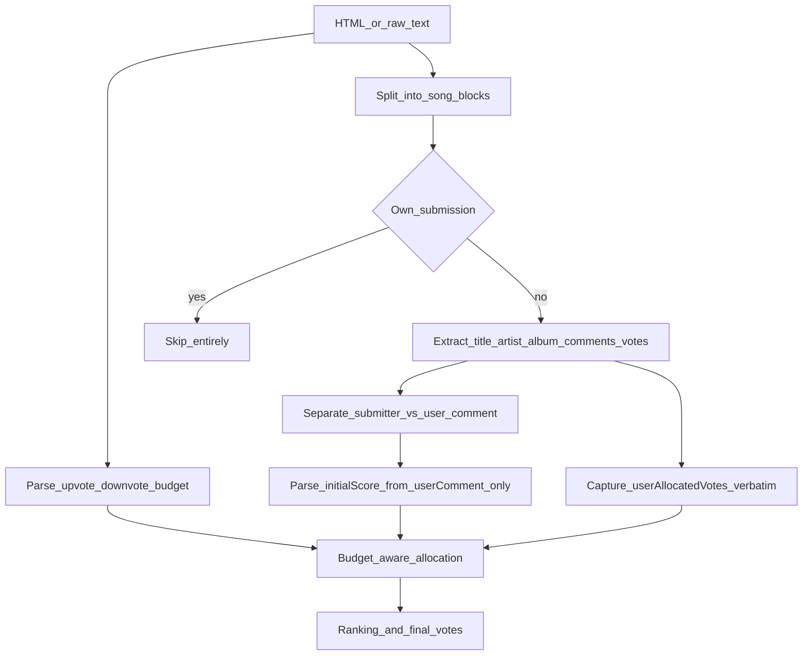

# Round Input Parsing Spec

## Problem

Parsing guidance today is split and incomplete, and it mis-models the most important signal — the user's own votes:

- [`spec/score-parsing.md`](spec/score-parsing.md) covers **notation** (755 → 75.5) but not **where** scores live in input.
- [`spec/comments.md`](spec/comments.md) distinguishes submitter vs user comments conceptually but gives no field-level extraction rules.
- [`.cursor/rules/parsing.mdc`](.cursor/rules/parsing.mdc) repeats score notation only.
- The current model treats the per-song number (`data-weight`) as a **platform** upvote count. In practice that number is the **user's own pre-allocated vote** for that song. It must be preserved verbatim and factored into allocation, not treated as external metadata.
- Nothing today parses the round's **vote budget** (how many upvotes/downvotes the user must distribute), so allocation has no target total.

The sample round [`rounds/2026-06-06-aaa-logo.html`](rounds/2026-06-06-aaa-logo.html) / [`.txt`](rounds/2026-06-06-aaa-logo.txt) shows the real structure agents must handle, including the common failure modes of treating the user's own vote as an external weight, merging submitter and user comment blocks, or trying to parse the user's own submission.

## Proposed structure

Create **[`spec/round-input-parsing.md`](spec/round-input-parsing.md)** as the canonical input-mapping spec. Keep score notation in [`spec/score-parsing.md`](spec/score-parsing.md) unchanged.

Update **[`.cursor/rules/parsing.mdc`](.cursor/rules/parsing.mdc)** with a short preamble: parse round input into fields (including the user's pre-allocated votes and the vote budget) first, then apply score notation rules to the **user comment only**.

Cross-link from [`spec/comments.md`](spec/comments.md) (field ownership/disambiguation) and [`spec/point-allocation.md`](spec/point-allocation.md) (honor pre-allocated votes and budget).

Optional one-line pointer in [`README.md`](README.md) under workflow step 2.

## Per-song output model

Each song block should normalize to:

| Field | Purpose |
|---|---|
| `title` | Track name |
| `artist` | Performing artist |
| `album` | Album name (metadata; not used as title) |
| `isOwnSubmission` | User submitted this entry — **skip entirely**, do not parse its fields |
| `userAllocatedVotes` | The number shown for the song = the **user's own pre-allocated vote** (their input). Display verbatim; factor into allocation. Absent if the user has not voted on it yet. |
| `submitterComment` | Quote block from submitter |
| `userComment` | Voter's textarea notes |
| `initialScore` | Numeric score parsed from `userComment` via score-parsing rules (separate from `userAllocatedVotes`) |
| `needsUserInput` | True when only a placeholder prompt is present and no vote/comment/guidance exists → ask the user |

> Naming note: the previously-tagged `mlWeight` is renamed to `userAllocatedVotes` to reflect that a number there is the **user's own vote**, not a platform metric. If a number is present, treat it as the user's input.

## Vote budget (parse first)

Above the song list, the page states how many votes the user has to spend. Parse:

- `upvoteBudget` — number of upvotes (positive points) to distribute.
- `downvoteBudget` — number of downvotes, when the round allows them.

Capture these from the round header text (HTML: the voting header / progress area; text: the lines above the first `Album art`). The total allocation must reconcile to this budget. If the budget cannot be found, ask the user rather than guessing.

## HTML mapping (preferred source, but see token note)

Anchor each song on `div.song` (e.g. `#song-0`).

| Field | Selector / signal |
|---|---|
| `title` | `h6.mb-0.text-truncate` (purple track name) |
| `artist` | First `span.d-block.text-truncate` in the metadata row |
| `album` | Adjacent `span.text-body-secondary` |
| `userAllocatedVotes` | `data-weight` on `div.song` — the **user's own pre-allocated vote** |
| `userComment` | `data-comment` on `div.song` (primary); fallback to `textarea[name="comment"]` body if populated |
| `submitterComment` | Non-empty text in `span.ws-pre-wrap` inside the quoted `
` with `bi-quote` icon, when visible (`x-show="true"`) |
| `isOwnSubmission` | `mine: true` in `x-data`, or visible card-header `You submitted this song` → **skip the block** |
| `spotifyUri` | `input[name="uri"]` (optional dedup key) |

**Hard disambiguation rules to document:**

- `data-comment` is always the **user** comment, never the submitter quote.
- `data-weight` is the **user's own vote**, not a platform/aggregate metric. Display verbatim; it is the "raw score" in the slim output table.
- Submitter text lives only in the quote `
`, e.g. BUGY CRAXONE: submitter = `"they change their logo a lot..."`, user = `"As far as I can tell, that's not a logo..."`.
- Do **not** parse ranking scores from submitter comments.

> **Token note (from working notes):** the HTML is well-structured but very large and expensive to clean up inline. Pattern-based text parsing with owner clarification has worked fine and is cheaper. A future non-AI extraction script could pull just the useful bits from HTML; treat HTML field-precise parsing as optional until then.

## Raw text mapping (fallback / default)

Above the list, read the **vote budget** (upvotes/downvotes) before the first song.

Song blocks begin at a line exactly matching `Album art`.

Within each block, read in order:

1. Optional marker line: `You submitted this song` → `isOwnSubmission = true` → **skip the entire block, parse nothing**.
2. `Album art` (delimiter; discard)
3. Line 1 → `title`
4. Line 2 → `artist`
5. Line 3 → `album`
6. Next line → `userAllocatedVotes` **if** it is a standalone integer (the user's own pre-allocated vote); skip if absent (a song the user hasn't voted on yet).
7. Placeholder lines `What did you think of this song?` / `What did you think of your own song?`: if the block has **no** vote, comment, or guidance, set `needsUserInput = true` and **prompt the user** for a score or guidance for that song. (Own-submission blocks are already skipped at step 1.)
8. Comment region until `\d+ / 1000` char-count footer:
   - **One** non-empty text block → `userComment`
   - **Two** blocks separated by blank lines → first = `submitterComment`, second = `userComment` (IVE and BUGY CRAXONE patterns in sample txt)
9. Discard the `N / 1000` line and page chrome (nav, league header, `Saving progress...`, etc.) — only parse content after the round prompt / song list.

Document multiline submitter comments (IVE: two lines before user comment) as a single `submitterComment` preserving line breaks.

## Initial score rules

Add an **Initial Score** section that chains to existing specs:

1. **Source:** parse score tokens **only** from `userComment` ([`spec/score-parsing.md`](spec/score-parsing.md)).
2. **Never use:** submitter comment text, album/title/artist fields. `userAllocatedVotes` is the user's vote, tracked separately (see Allocation), not parsed as a comment score.
3. **Multiple scores in one comment** (e.g. `72 music, 8 fit`): follow [`spec/comments.md`](spec/comments.md) — treat as scoring evidence; apply fit-evaluation weighting from [`spec/fit-evaluation.md`](spec/fit-evaluation.md) before picking the ranking value.
4. **No explicit score token:** set `initialScore = unset`; do not invent a number from prose. Use `userAllocatedVotes` (if present), fit evaluation, and/or ask the user. Many real rounds use qualitative notes only.
5. **Explicit `-` in user comment:** below consideration per score-parsing bare-dash rule.
6. After extraction, numeric conversion happens before ranking (existing hard rule).

## Allocation (budget-aware, honors the user's votes)

Extend [`spec/point-allocation.md`](spec/point-allocation.md) with these inputs:

1. **Honor pre-allocated votes.** `userAllocatedVotes` represents points the user already committed (e.g. ≥1 to every valid entry, 2 to better ones). Carry them into the result verbatim and use them as the floor/seed for ranking.
2. **Reconcile to budget.** Total final votes must equal `upvoteBudget` (and `downvoteBudget` where applicable). If the user has spent less than the budget, distribute the remainder using comments + fit evaluation.
3. **Over-allocation handling.** If pre-allocated votes already exceed the budget, the assistant must **flag candidates to lower** (weakest fit / lowest user enthusiasm) so the user can trim back to budget, rather than silently rebalancing.
4. **Own song** is excluded from all totals.

## Output spec

Produce **two** tables:

1. **Full ranked table** — sorted by final score/votes (best first). Columns: rank, `title`, **`artist`** (new), `album`, `userAllocatedVotes` (raw score), `finalVotes`, full `userComment`, `submitterComment`, and any score notes/metadata. This is the detailed working view.
2. **Slim raw-order table** — sorted in the **original raw song order** (as pasted). Columns: `title`, `finalVotes`, and the user's **raw score** (`userAllocatedVotes`). This mirrors the Music League page order for quick entry/verification.

Also surface, above the tables: the parsed `upvoteBudget`/`downvoteBudget`, the total allocated, and any over-budget warnings or `needsUserInput` prompts.

## Cursor rule update

Extend [`.cursor/rules/parsing.mdc`](.cursor/rules/parsing.mdc) to ~12 lines:

- Parse round input per `spec/round-input-parsing.md` before score conversion: budget first, then per-song fields.
- Skip the user's own submission entirely.
- A standalone number on a song is the **user's own vote** (`userAllocatedVotes`) — preserve verbatim, factor into allocation.
- On a placeholder prompt with no vote/comment, ask the user for a score/guidance.
- Keep existing 755/735 notation bullets; initial score comes from the user comment only.

## Regression coverage (recommended)

Add **[`tests/regressions/006.md`](tests/regressions/006.md)** with concrete expectations from the sample round:

- Budget: expected upvotes/downvotes parsed from above the list.
- BUGY CRAXONE: submitter ≠ user comment; `userAllocatedVotes` captured verbatim; no score token in comment → unset initial score.
- IVE: multiline submitter comment preserved; user comment separate.
- Gangnam Style: single comment block → user only, empty submitter.
- ONEUS: `isOwnSubmission=true` → block skipped entirely, contributes nothing to totals or tables.
- A placeholder-only song → `needsUserInput=true`, prompts the user.
- Over-allocation case → assistant flags candidates to lower.

This gives agents a fixture-backed check without building a parser implementation yet.

## Files to touch

| File | Change |
|---|---|
| `spec/round-input-parsing.md` | **New** — full mapping spec: budget parsing, HTML + text field mapping, own-song skip, placeholder prompting, `userAllocatedVotes`, initial-score rules, output spec |
| `spec/point-allocation.md` | Add budget-aware allocation that honors pre-allocated votes and flags over-budget candidates |
| `.cursor/rules/parsing.mdc` | Add input-parsing preamble + cross-reference + own-song/placeholder/user-vote reminders |
| `spec/comments.md` | Add link to round-input spec for field ownership |
| `tests/regressions/006.md` | **New** — budget, pre-allocated votes, own-song skip, placeholder, over-allocation fixtures |
| `README.md` | Optional one-line spec index entry |

No code or parser implementation in this change — documentation only, aligned with the agent-driven workflow in the README. A non-AI HTML extraction script is noted as possible future work to reduce token cost.
