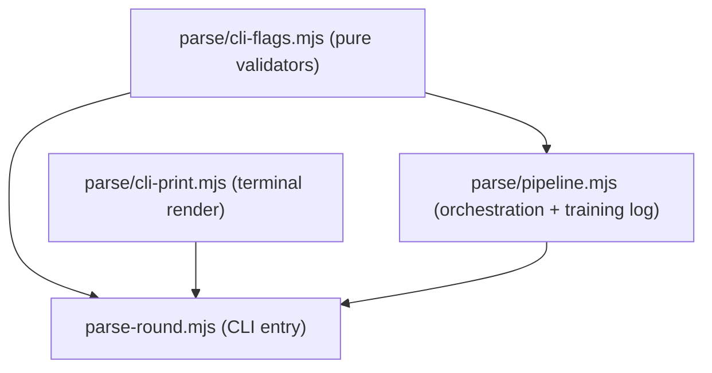

> **Sequence:** [split-pipeline-stages.plan.md](split-pipeline-stages.plan.md) removes
> merge and pick from `parse-round.mjs` first. This module split then applies to the
> **slim parse entry** only; `applyOptionPick` / `recordPickToTrainingLog` move to
> `pick-round.mjs` (or `scripts/round/pick.mjs`), not `parse/pipeline.mjs`.

# Split parse-round.mjs

## Goal

`scripts/parse-round.mjs` is 722 lines mixing three distinct concerns behind one file. Separate them into small, focused modules so each can be read, tested, and extended independently.

The split does **not** change any behavior. Any diff in test results or CLI output means a mistake.

## Current shape (three concerns tangled together)

```
parse-round.mjs (722 lines)
├── CLI flag validators (exported, testable, pure)
│     parsePins, pinCapError, parseTierCount, parseBucketCount,
│     parseFavoriteBand, parseDownShape, parseWeights, buildGate
├── Terminal renderers (private print helpers)
│     printTextTable, printTradeoffCli, printBallotCli
├── Pipeline orchestration (private, side-effectful)
│     parseRoundHtml, resolveOptionIndex, reconcileOptionPins,
│     resolveOptionPick, applyOptionPick, recordPickToTrainingLog
│     warnBudgetMismatch, parseCountFlag
└── main() — the CLI entry point
```

## Target layout

```
scripts/
  parse-round.mjs          ← CLI entry; imports from all three below; unchanged public surface
  parse/
    cli-flags.mjs          ← pure flag validators; no node:* except maybe node:path for parseWeights
    cli-print.mjs          ← terminal print helpers; imports from score-core + render-html-shared
    pipeline.mjs           ← pipeline orchestration + recordPickToTrainingLog
```

### `scripts/parse/cli-flags.mjs`

Pure functions only — no I/O, no `process.exit`, no `node:fs`. Every function is already exported from `parse-round.mjs`; they just move here and get re-exported from the entry-point.

Exports: `parsePins`, `pinCapError`, `parseTierCount`, `parseBucketCount`, `parseFavoriteBand`, `parseDownShape`, `parseWeights`

Internal helpers (stay private): `parseCountFlag`

**After `split-score-core` Phase 4:** `parseDownShape` can delegate to `normalizeDownShape` from `scripts/score/allocate.mjs`, eliminating the duplicate alias table.

### `scripts/parse/cli-print.mjs`

Terminal rendering: the "needs your call" tradeoff table and the raw-order ballot. No I/O other than `console.log`.

Exports: `printTradeoffCli`, `printBallotCli`, `printTextTable`

Imports: `formatScore` from `../score-core.mjs` (or the barrel after split), `buildComboBallot` from `../render-html-shared.mjs`

### `scripts/parse/pipeline.mjs`

Orchestration helpers that wire parsed data to the allocator, handle `--option` picks, and write the training log.

Exports: `reconcileOptionPins`, `resolveOptionPick`, `applyOptionPick`, `recordPickToTrainingLog`

Internal: `resolveOptionIndex`, `warnBudgetMismatch`, `parseRoundHtml`

Imports: `score-core.mjs`, `paths.mjs`, `extract-html.mjs`, `node:fs/promises`

### `scripts/parse-round.mjs` (after split)

Keeps `parseArgs`, `main()`, and the guard `if (process.argv[1] …) main()`. Imports everything from the three sub-modules and re-exports the public surface (`parsePins`, `pinCapError`, `parseTierCount`, `parseBucketCount`, `parseFavoriteBand`, `parseDownShape`, `parseWeights`, `reconcileOptionPins`, `resolveOptionPick`) so all existing importers (`tests/`, `render-final-html.mjs`) keep working unchanged.

## Dependency graph (acyclic)



## Sequencing constraint

Start this only **after** `split-score-core-into-modules` Phase 1 is green. Reason: `parse-round.mjs` imports from `score-core.mjs`; if the barrel is already in place, the sub-modules can import from `scripts/score/*.mjs` directly (browser-safe) instead of the barrel — avoiding a transitive dependency on the whole file.

If score-core split hasn't happened yet, the sub-modules simply import from `../score-core.mjs`. The plan works either way; the note above is an optimization.

## Phase 0 — capture baseline

1. `npm test` → record pass count. `npm run lint` → 0 errors.
2. Snapshot the exported surface of `parse-round.mjs`:
   `node -e "import('./scripts/parse-round.mjs').then(m=>console.log(Object.keys(m).sort().join('\n')))" > /tmp/ml-parse-exports-before.txt`
3. Run the full CLI on a real round and capture output to `/tmp/ml-cli-before.txt` as a spot-check.

## Phase 1 — the split

4. Create `scripts/parse/cli-flags.mjs` — move pure validators verbatim.
5. Create `scripts/parse/cli-print.mjs` — move terminal print helpers verbatim.
6. Create `scripts/parse/pipeline.mjs` — move orchestration helpers verbatim.
7. Rewrite `scripts/parse-round.mjs` to import from the three sub-modules and keep only `parseArgs`, `main()`, and the entry-point guard. Re-export the public surface.

## Phase 1 verification

8. Export parity: `node -e "import('./scripts/parse-round.mjs').then(m=>console.log(Object.keys(m).sort().join('\n')))" > /tmp/ml-parse-exports-after.txt && diff /tmp/ml-parse-exports-before.txt /tmp/ml-parse-exports-after.txt` → no diff.
9. `npm test` → same pass count.
10. `npm run lint` → 0 errors.
11. CLI smoke: run `node scripts/ml.mjs parse <round>` on a real round and confirm identical output.

## Phase 2 (optional) — add dedicated tests for cli-flags

The validators (`parsePins`, `parseWeights`, `parseDownShape`, etc.) are already exercised indirectly by `tests/score.test.mjs` but have no dedicated file. Add `tests/parse-flags.test.mjs` mirroring the existing test style. `npm test` count grows; no regressions.

## Phase 3 (optional) — de-duplicate `OPTION_LETTERS`

After `split-score-core` Phase 4, `OPTION_LETTERS` is exported from `scripts/score/render.mjs`. Import it in `cli-print.mjs` instead of redefining locally.

## Risks and mitigations

- A circular import if `pipeline.mjs` accidentally imports from the entry-point: caught by `npm run lint` and a quick `node --check`.
- A re-exported name silently dropped: caught by the export parity diff (step 8).
- Existing tests import `parsePins` etc. from `parse-round.mjs`: the re-export preserves the surface, so no test changes are needed.

## Commit / docs

One commit per phase: "Split parse-round CLI validators into parse/cli-flags.mjs", etc. Add a one-line note to `spec/decisions.md`. Await explicit go-ahead per the no-auto-commit rule.
