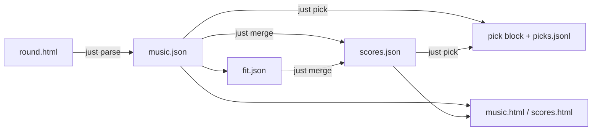

# Split pipeline stages

## Principle

Three operations that today share `parse-round.mjs` are **unrelated** and must not
be coupled:

| Stage | Input | Output | Reads HTML? |
| --- | --- | --- | --- |
| **Parse** | Round HTML (finished voting) | `music.json`, `music.md` | Yes — once |
| **Merge** | `music.json` + `fit.json` | `scores.json` | No |
| **Pick** | `music.json` or `scores.json` | same JSON + `pick` + `picks.jsonl` + refreshed md | No |

Render (`just final`, `just fit`, `just scores`) stays read-only over JSON.

**Normal workflow:** finish voting in Music League → export HTML → `just parse` →
(optionally fit research → `just merge`) → `just pick` → `just final`.

Re-parse is **not** part of the happy path. It only applies when you replace the
HTML export (fixed save, changed scores). A fresh parse writes a new `music.json`
without a `pick` block; you run `just pick` again if needed.

## Current coupling (to remove)

`parse-round.mjs` today does all of this in one `main()`:

```text
HTML ──parse──► allocate ──► music.json
                │
                ├── --fit fit.json ──mergeFitJson──► scores.json
                │
                └── --option B --reason "…" ──applyOptionPick──► pick + picks.jsonl
```

Flags like `--option`, `--reason`, `--fit`, merge weights/gates on the parse CLI blur
stage boundaries and force HTML re-reads for JSON-only work.

## Target architecture



### Scripts

| Script | Responsibility |
| --- | --- |
| **`parse-round.mjs`** (slim) | HTML/text → score comments → allocate → write `music.json` + `music.md`. Allocator tuning flags (`--shape`, `--tier-count`, `--pin` for *exploration during parse*) stay here. **No `--fit`, no `--option`, no `--reason`.** Never writes `pick`. |
| **`merge-scores.mjs`** (new) | Load `music.json` + `fit.json` → `mergeFitJson` → write `scores.json`. Merge flags (`--rank`, `--weights`, `--gate`, `--cutoff`) live here only. |
| **`pick-round.mjs`** (new) | Load `music.json` or `scores.json` → replay allocation from stored songs/budget/tradeoffs → `applyOptionPick` → write JSON + md + `picks.jsonl`. Flags: `--option`, `--reason`, `--pin`, `--down-shape`. **No HTML, no fit file.** |
| **`render-final-html.mjs`** | Unchanged — reads JSON. |
| **`render-fit-html.mjs`** | Unchanged. |
| **`ml.mjs`** | Dispatches `parse` / `merge` / `pick` / `final` / `status` / `help`. |

Shared logic moves to **`scripts/round/`** (or stays in `parse/pipeline.mjs` until
[split-parse-round-into-modules.plan.md](split-parse-round-into-modules.plan.md)):

- `applyOptionPick`, `resolveOptionPick`, `recordPickToTrainingLog` → used by
  `pick-round.mjs` only
- `mergeFitJson` path from parse → `merge-scores.mjs` only

### Ownership rules

| Field / file | Written by |
| --- | --- |
| `music.json` songs, scores, tradeoffs | **parse** only |
| `music.json` `pick` | **pick** only (parse must not set or clear it) |
| `scores.json` merged songs, draftVotes | **merge** only |
| `scores.json` `pick` | **pick** only |
| `picks.jsonl` | **pick** only |
| `fit.json` | agent / manual (never parse or merge) |

**Parse overwriting `music.json`:** drops any existing `pick` — intentional. You
re-pick after a fresh parse. No preserve-on-re-parse logic.

## Commands (`just` / `ml`)

```bash
just parse <name>              # HTML → music.json (once, after voting done)
just merge <name>              # music.json + fit.json → scores.json
just pick <name> <A|B|C> --reason "…" [--pin …] [--down-shape …]
just final <name>              # render from JSON
just status <name>             # checklist per stage
```

Deprecate (warn once, then remove):

```bash
just parse <name> --option B   # → "use just pick <name> B"
just parse <name> --fit …      # → "use just merge <name>"
```

## `pick-round.mjs` behavior

1. Resolve round → `music.json` or, if `scores.json` exists and user passed
   `--scores` / auto-detect thematic, load scores file.
2. Error if file missing: *"Run just parse first"*.
3. Reconstruct allocation context from JSON:
   - `songs` (with scores), `budget`, `tradeoffs` (for menu if still present)
   - Re-run `allocate` / `mergeFitJson` **from JSON fields** to refresh live
     votes and rebuild menu when `tradeoffs` is empty post-pick (unpinned pass)
4. `applyOptionPick` → update `finalVotes`/`draftVotes`, set `pick`, regenerate md
5. `recordPickToTrainingLog`

No round HTML path, no `readFile(round.html)`.

**Profile replay:** serialize minimal allocator `profile` in JSON during parse
(`shape`, `downShape`, gate, weights if any) so pick replays the same menu. If
absent, derive defaults from `budget` + `mode` (document limitation).

## `merge-scores.mjs` behavior

1. Load `music.json` + `fit.json` for round id
2. `mergeFitJson(musicPayload, fitData, profile)` — music songs from JSON, not HTML
3. Write `scores.json`; leave `fit.json` unchanged
4. Does **not** pick, does **not** render HTML

Today merge re-reads HTML to get fresh music scores — that coupling goes away.
Music scores come from `music.json` produced by parse.

## `parse-round.mjs` after slimming

Keeps:

- HTML/text extraction, `scoreComment`, initial `allocate`
- `--mode`, `--shape`, `--tier-count`, `--bucket-count`, `--pin` (explore allocation at parse time)
- `music.md` + `music.json` output with `tradeoffs` menu

Removes:

- `--fit`, `--option`, `--reason` branches
- `recordPickToTrainingLog` calls
- `mergeFitJson` import in main path

Optional: `--profile-snapshot` always on (write profile into JSON for pick replay).

## Status / `just run` next steps

```text
no input        → export HTML
no music.json   → just parse
thematic, no fit.json → fit research (manual)
thematic, no scores.json → just merge
no pick         → just pick (see music.md options)
no final html   → just final
done
```

Music-only skips merge. Pick is always a distinct step after parse (or after merge
for thematic).

## Migration

1. Extract `pick-round.mjs` + `merge-scores.mjs`; wire `ml pick` / `ml merge`
2. Remove merge/pick from `parse-round.mjs`; deprecation warnings on old flags for
   one release
3. Update README, skills, specs
4. Tests: each stage in isolation; no test requires HTML for pick or merge

## Relation to other plans

- **[improve-just-cli-and-docs](improve-just-cli-and-docs.plan.md)** — CLI/docs for
  these three commands; implement **after** stage split (Phase 2+ becomes thin
  wrappers only).
- **[pick-preserves-options](pick-preserves-options.plan.md)** — invariants for
  `pick-round.mjs` output; no re-parse preservation.
- **[split-parse-round-into-modules](split-parse-round-into-modules.plan.md)** —
  module split **inside** slim parse + shared `round/pick.mjs`; sequence: stage
  split first OR fold pick/merge modules into this plan's new scripts.

## Non-goals

- Parsing half-voted rounds as a supported workflow (status may warn; not a stage)
- Pick without prior parse/merge
- Merge without `music.json`

## Verification

```bash
npm test
# Stage isolation:
just parse sample-round
just pick sample-round A --reason "test"
grep '"pick"' data/analysis/.../music.json
just merge sample-round   # only if fixture has fit.json
# pick must not read HTML:
strace -e openat node scripts/pick-round.mjs ... 2>&1 | grep -v '\.html'
```
