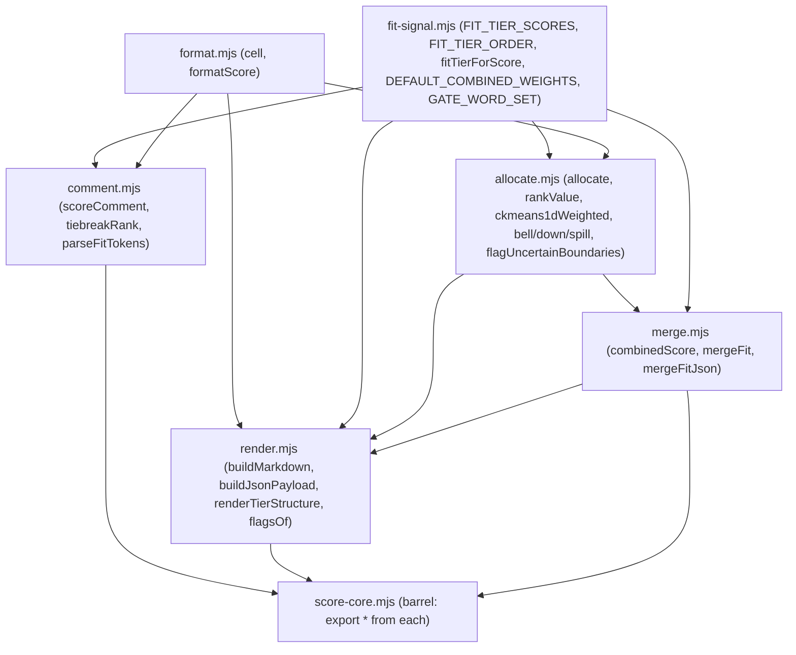

# Split the big files safely

## Goal

`scripts/score-core.mjs` is 1627 lines spanning five concerns. Split it into small pure modules under `scripts/score/`, keep `scripts/score-core.mjs` as a thin **re-export barrel** so every existing `./score-core.mjs` import keeps working unchanged, and wrap the whole thing in verification that proves behavior is byte-for-byte identical.

This is a **mechanical move with no logic changes**. Any diff in test results or generated output means a mistake.

## Why it's safe (dependency graph is acyclic)

`rankValue` (allocation) uses only the constant `DEFAULT_COMBINED_WEIGHTS`, not `combinedScore`, so allocation does not depend on the merge layer. The layering is one-directional:



Constraint to preserve: **no `node:*` imports** in any `scripts/score/*` module (keeps them browser-importable for the planned web app, which already shares `scoreComment` via [scripts/extract-html.mjs](scripts/extract-html.mjs)).

## Target layout and function map

New dir `scripts/score/`; [scripts/score-core.mjs](scripts/score-core.mjs) becomes the barrel.

- `scripts/score/format.mjs` — `cell`, `formatScore`
- `scripts/score/fit-signal.mjs` — `FIT_TIER_SCORES`, `FIT_TIER_ORDER`, `fitTierForScore`, `DEFAULT_COMBINED_WEIGHTS`, `GATE_WORD_SET`
- `scripts/score/comment.mjs` — `scoreComment`, `tiebreakRank`, `parseFitTokens`, `FIT_TIER_SYNONYMS`, `GATE_WORDS`
- `scripts/score/allocate.mjs` — `rankValue`, `estimateCenter`, `SHAPE_PRESETS`, `shapeParams`, `bellWeights`, `songGate`, `gateClass`, `coarseFit`, `tierKey`, `rankSort`, `rankSortAsc`, `enrichProfileWithBudget`, `opinionCenter`, `spectrumTargets`, `allocate`, the downvote set (`finishDownvotes`, `downEligible`, `allocateDownvotes`, `downBellWeights`, `allocateRelativeDown`, `allocateBellDown`, `spillDownRemainder`), `spillRemainder`, `allocateRelative`, `ckmeans1dWeighted`, `waterfillLevels`, `allocateBell`, `flagUncertainBoundaries`
- `scripts/score/merge.mjs` — `combinedScore`, `normTitle`, `mergeFit`, `mergeFitJson`
- `scripts/score/render.mjs` — `flagsOf`, `formatVoteAllocation`, `rankedSort`, `renderTable`, `renderTierStructure`, `buildMarkdown`, `buildJsonPayload`

Barrel contents:

```js
export * from './score/format.mjs';
export * from './score/fit-signal.mjs';
export * from './score/comment.mjs';
export * from './score/allocate.mjs';
export * from './score/merge.mjs';
export * from './score/render.mjs';
```

Helpers used by only one module stay un-exported there; helpers used across modules (e.g. `fitTierForScore`, `DEFAULT_COMBINED_WEIGHTS`, `rankValue`) get exported from their home module and imported where needed. The barrel's `export *` preserves the full public surface.

## Phase 0 — capture a baseline (before touching anything)

1. `npm test` → record "51 pass" and `npm run lint` → "0 errors".
2. Snapshot the public API:
   `node -e "import('./scripts/score-core.mjs').then(m=>console.log(Object.keys(m).sort().join('\n')))" > /tmp/ml-exports-before.txt`
3. Golden end-to-end outputs (analysis/ is gitignored, so snapshot to /tmp): regenerate every round's artifacts and copy them aside.
   - For each `rounds/*.{html,txt}`: `node scripts/parse-round.mjs <file>` (and `--fit analysis/<base>-fit.json` where a fit sidecar exists), plus `node scripts/render-final-html.mjs` / `render-fit-html.mjs`.
   - `cp -r analysis /tmp/ml-before`

## Phase 1 — the split (score-core)

4. Create the six `scripts/score/*.mjs` files, moving each function verbatim (no edits to bodies) and adding the imports each module needs per the graph above.
5. Replace [scripts/score-core.mjs](scripts/score-core.mjs) body with the barrel re-exports.
6. Leave all importers untouched ([scripts/parse-round.mjs](scripts/parse-round.mjs), [scripts/parse-text.mjs](scripts/parse-text.mjs), [scripts/extract-html.mjs](scripts/extract-html.mjs), [scripts/render-final-html.mjs](scripts/render-final-html.mjs), [tests/score.test.mjs](tests/score.test.mjs)) — they still import from `./score-core.mjs`.

## Phase 1 verification (must all pass)

7. No circular/undefined exports: `node -e "import('./scripts/score-core.mjs').then(m=>{const u=Object.entries(m).filter(([,v])=>v===undefined).map(([k])=>k); if(u.length) throw new Error('undefined exports: '+u); console.log('exports ok', Object.keys(m).length)})"`
8. Export parity: regenerate the export list and `diff /tmp/ml-exports-before.txt` against it → identical.
9. `npm test` → identical "51 pass" (the existing suite, unchanged, is the primary net since it exercises `scoreComment`, `allocate`, `ckmeans1dWeighted`, `mergeFit`, `mergeFitJson`, `rankValue`, `estimateCenter`, `fitTierForScore`).
10. `npm run lint` → 0 errors (ESLint flags unused imports / undefined refs from a bad move).
11. Golden diff: regenerate analysis/ for all rounds and `diff -r /tmp/ml-before analysis` → no differences.
12. Per-module syntax/import smoke check: `for f in scripts/score/*.mjs; do node --check "$f"; done` and `node -e "await import('./scripts/score/<each>.mjs')"`.

## Phase 2 (optional) — de-duplicate the HTML renderers

[scripts/render-fit-html.mjs](scripts/render-fit-html.mjs) and [scripts/render-final-html.mjs](scripts/render-final-html.mjs) both define `esc`, `TIER_HUE`/`tierHue`, `chip`, `STYLE`, `formatScore`, `renderHead`, `renderTransfer`. Extract a `scripts/render/html.mjs` with the shared escaping/chip/tier-hue/style helpers, and have both renderers import `formatScore`/`fitTierForScore` from the scoring barrel instead of redefining. Re-run the Phase-1 golden diff (steps 9/11) — output must stay identical.

## Phase 3 (optional) — split the test file to mirror modules

Split [tests/score.test.mjs](tests/score.test.mjs) (753 lines) into `tests/comment.test.mjs`, `tests/allocate.test.mjs`, `tests/merge.test.mjs` (importing from the specific modules or the barrel). `npm test` total count must be unchanged. Do this only after Phase 1 is green so the original file remains the reference net during the move.

## Risks and mitigations

- Circular import → `undefined` export (TDZ): prevented by the acyclic layering; caught by step 7.
- A missed cross-module helper: caught by `npm run lint` (undefined ref) and `npm test`.
- Subtle output drift: caught by the golden `diff -r` (step 11).
- Browser-safety regression: keep `scripts/score/*` free of `node:*` imports; the only file-system/path imports live in the renderers and `parse-round.mjs`.

## Commit / docs

Commit as one reviewable "Refactor score-core into modules (no behavior change)" commit (await explicit go-ahead per the no-auto-commit rule), with Phases 2/3 as their own commits if pursued. This is a structural refactor, not a behavior change, so a [spec/decisions.md](spec/decisions.md) entry is optional — add a one-line note only if you want the module layout recorded.
