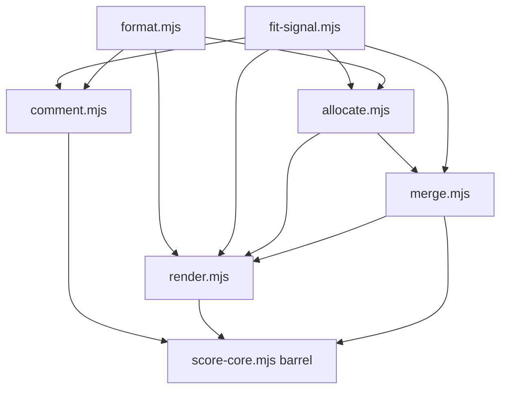

# Split score-core into modules

**Phase 1 shipped** (`0b5a05e`): six modules under `scripts/score/`, thin barrel in
`scripts/score-core.mjs` (explicit named re-exports; 23 public symbols unchanged).
`mergeFitJson` lives in `render.mjs` to keep allocate↔merge acyclic. Export parity
verified; tests green.

**Remaining:** Phases 2–4 below (optional polish). **Sequence:** Wave 4 of [remaining-work-master.plan.md](remaining-work-master.plan.md) — after output snapshot regression test (Wave 2).

## Module layout (reference — shipped in Phase 1)

| Module | Key exports |
| --- | --- |
| `format.mjs` | `cell`, `formatScore` |
| `fit-signal.mjs` | `FIT_TIER_SCORES`, `fitTierForScore`, `DEFAULT_COMBINED_WEIGHTS`, `GATE_WORD_SET` |
| `comment.mjs` | `scoreComment`, `tiebreakRank`, `parseFitTokens` |
| `allocate.mjs` | `allocate`, `rankValue`, `ckmeans1dWeighted`, `SHAPE_PRESETS`, … |
| `merge.mjs` | `combinedScore`, `mergeFit`, `mergeFitJson`, `normalizeCombined`, … |
| `render.mjs` | `buildMarkdown`, `buildJsonPayload`, `buildPickRecord`, `renderTierStructure`, … |

Constraint: **no `node:*` imports** in `scripts/score/*` (browser-importable for web app).

Importers still use `./score-core.mjs` only — no importer churn.

### Duplication to fix in Phase 4

- **`normalizeDownShape`** (private in `allocate.mjs`) vs **`parseDownShape`** (in
  `parse/cli-flags.mjs`) — same alias table; export from allocate, delegate in parse.
- **`OPTION_LETTERS`** — defined in `render.mjs`, `render-html-shared.mjs`, and
  `parse-round.mjs`; export from `render.mjs`, import elsewhere.

---

## Phase 2 — de-duplicate the HTML renderers

[scripts/render-fit-html.mjs](scripts/render-fit-html.mjs) and
[scripts/render-final-html.mjs](scripts/render-final-html.mjs) both define local
`renderHead` functions and duplicate sorting logic.

1. Extract `scripts/render/html.mjs` with shared escaping/chip/tier-hue/style helpers
   beyond what already lives in `render-html-shared.mjs`.
2. Have both renderers import `formatScore` / `fitTierForScore` from the scoring
   barrel instead of redefining.
3. Re-run the **output snapshot regression diff** — regenerated artifacts must match
   the baseline (see Phase 0 below).

**Verification:**

- `npm test` — same pass count
- `diff -r /tmp/ml-before data/analysis` — no differences (capture baseline first
  if `/tmp/ml-before` is stale)

---

## Phase 3 — split the test file to mirror modules

Split [tests/score.test.mjs](tests/score.test.mjs) into:

- `tests/comment.test.mjs`
- `tests/allocate.test.mjs`
- `tests/merge.test.mjs`

Import from specific modules or the barrel. **`npm test` total count must be
unchanged.** Do this only after Phase 1 is green (done) so the original file
remained the reference net during the move.

---

## Phase 4 — de-duplicate helpers

1. Export `normalizeDownShape` from `scripts/score/allocate.mjs`; have
   `parseDownShape` in `parse/cli-flags.mjs` delegate (keep throw-on-invalid in parse).
2. Export `OPTION_LETTERS` from `scripts/score/render.mjs`; import in
   `render-html-shared.mjs` and `parse/cli-print.mjs` (or wherever still duplicated).

Small targeted cleanup; run only after Phase 1 confirmed green.

---

## Phase 0 — regression baseline (for Phase 2 diff test)

Before Phase 2, capture saved pipeline outputs so you can diff after the refactor.
This is a **manual regression test** today (formalize later per followup-5).

If `/tmp/ml-before` is missing, recapture:

1. `npm test` → record pass count; `just lint` → clean.
2. Export snapshot:
   `node -e "import('./scripts/score-core.mjs').then(m=>console.log(Object.keys(m).sort().join('\n')))" > /tmp/ml-exports-before.txt`
3. Regenerate analysis artifacts for active rounds → `cp -r data/analysis /tmp/ml-before`

---

## Risks and mitigations

- Circular import → `undefined` export (TDZ): acyclic layering; smoke-check imports.
- Missed cross-module helper: caught by lint + tests.
- Subtle output drift: output snapshot regression diff (`diff -r`).
- Browser-safety regression: keep `scripts/score/*` free of `node:*`.

## Commit / docs

One commit per phase. Add `spec/decisions.md` entry when each phase lands.
