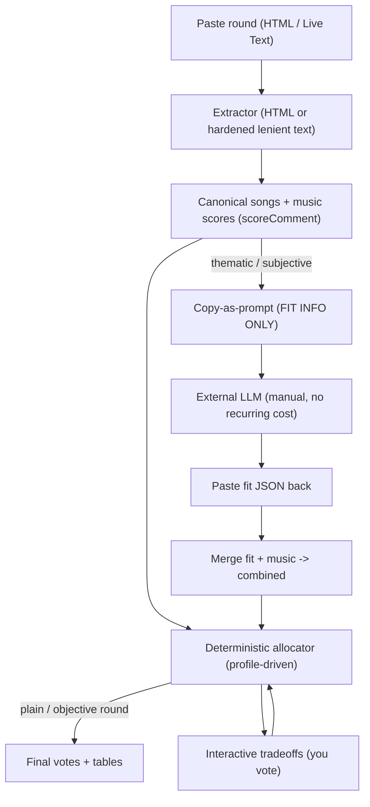

# Web app + deterministic allocation engine

Two plan-file rewrites plus the parser work that makes the mobile path real. The allocation engine (Follow-up 4) is the foundation: making tiering deterministic is what lets the web app's copy-prompt stay **fit-only** in the common case.

## Architecture (how the pieces fit)

Key division of labor (corrected per your clarification):

- The copy-prompt contains **fit info only**: round criteria/keywords, song list minus your own, your existing fit comments + a hint to build on them, and the output format (pared-down fit JSON). It says nothing about music scores or merging.
- A deterministic **merge + allocate** step combines the returned fit with the music scores already parsed from your comments.
- Pride-style rounds = a fit mode where the LLM returns gate flags (`pass`/`fail`, or `pass`/`maybe`/`fail`). The `maybe`/questionable band is a conditional tier — rewarded above the clear-fails only when budget is plentiful or you dial leniency up. Within that band, order by **how defensible the interpretation is** (the LLM's "makes the most sense" ranking / fitScore), with music only as a secondary tiebreak — not by music first.
- Music scores + point rules only enter the prompt via a **fallback toggle**, used only when the deterministic allocator genuinely can't handle a round.

---

## Plan A — Follow-up 4: deterministic allocation engine

Rewrite allocation presets plan (shipped — see `spec/decisions.md` and git history). Today [scripts/score-core.mjs](scripts/score-core.mjs) `allocate()` does one thing: a relative largest-remainder draft (`weight = score - lowest`). Generalize it into a profile-driven allocator. Keep the existing behavior as the default profile.

Introduce an **allocation profile** (object passed into `allocate`, selectable in CLI/web):

- `rankBy`: `music` (music primary, fit tiebreak) / `fit` (fit primary, music tiebreak) / `combined` (weighted `w.fit*fit + w.music*music`). Tiebreak chain always ends: higher score, then modifier rank (`play >= + > plain > -`), then title — reusing `tiebreakRank()`.
- `cutoff` / gate: a hard boundary below which songs earn 0 regardless of the other axis. Expressed three ways:
  - a fit score or tier name (e.g. `solid`) for graded rounds;
  - `passFail` — binary gate (e.g. "song starts with a verb"): `pass` -> eligible, `fail` -> 0; allocate among passes by music;
  - `passFailMaybe` — three-state gate for rounds with creative-but-arguable entries (e.g. Pride): `pass` (clearly qualifies), `maybe`/`questionable` (defensible interpretation), `fail` (clearly off). `fail` always earns 0. `maybe` forms a **conditional tier below the passes**: skipped entirely when the budget is tight/oversubscribed, but filled (ahead of fails) when votes are plentiful — controllable via a `leniency` knob and auto-suggested from the points-to-eligible-songs ratio. The `maybe` band is ordered by **how defensible the interpretation is** (an LLM-supplied strength/fitScore within the band — "makes the most sense"), with music as a secondary tiebreak only. This is the album-art case: lots of votes to go around, so questionable entries got rewarded over the definitely-wrong ones and the round ran more tiers.
  - This is the "strict cutoff boundaries for fit".
- `shape`: how ranked candidates become point tiers. The core model is a **mode-centered bell** matched to the point budget (see "Allocation model" below); the variants are:
  - `auto` (**default**): mode-centered bell whose width is chosen automatically from the points-to-songs ratio and the spread of your scores.
  - `bell`: explicit mode-centered curve (the model below) with a fixed/manual width.
  - `presets`: `compressed` (narrower — fewer tiers, most songs at the average), `balanced` (symmetric), `top-heavy` (skew the spare points upward). Width/skew overrides on the bell; from the original Follow-up 4 scope.
  - `relative` (legacy): the current `score − lowest numeric score` spread. Kept selectable, but no longer default — it anchors on the floor, which mis-models intent (see below).
- `sameScoreSameTier`: songs whose rank-key ties (equal music, or equal music with a fit gap <= epsilon, default ~3) **share a tier and get equal points** — codifying the "Letting Go == Waking up Slow" rule that the LLM keeps getting wrong. This is enforced structurally, not left to judgment.
- `modifiers`: `+`/`-` are within-tier nudges; `?` near a tier boundary is surfaced for review (existing logic, kept); `play` is a positive tiebreak; bare `-`/`no`/`invalid` already DQ in `scoreComment`.
- caps/budget/floors/downvotes/overrides: keep the original Follow-up 4 scope (this plan supersedes that file). Per-song cap, exact budget, manual per-song overrides that rebalance the rest. `userAllocatedVotes` (the `data-weight` pre-allocation) is a **floor**; when pre-allocations exceed budget, **surface a tradeoff listing candidates to lower** rather than silently rebalancing. Downvotes when `downvotesEnabled` (**MVP-skippable**): spend `downvoteBankSize` respecting `maxDownvotesPerSong`, with `isDisqualified` songs as the downvote candidates; this shifts the low tail into a limited `-1`/`-2` tier (see the Allocation model's 0-bound note).

**Allocation model: match the opinion curve to the point curve.** Allocation is fitting two bell curves together:

- **Opinion curve** = the distribution of your scores for the round (music, fit, or combined — they're separately bell-shaped and the model applies to each). Many songs cluster near a middle that **varies per round**, with a few standout highs and lows; some rounds are flatter, some sharper. Fit follows the same shape: a large "solid but unimaginative" middle, a short tail of standout great fits, and a tail of ones that make no sense (which the gate/cutoff lops off the bottom). How much you differentiate _within_ a fit band again scales with the point ratio available.
- **Point curve** = how the budget can be shaped. Its center is the **average points per song = budget / eligible songs**, and its width grows with the points-to-songs ratio.

Anchor on the **mode (center), not the floor.** Today's `relative` weights by `score − lowest numeric score`, but the floor is the wrong anchor:

- Songs you consider clearly unworthy get `-` (bare dash) or words, **not a low number** — so they're excluded from the curve entirely, they aren't its bottom.
- The lowest _numeric_ score is therefore "the lowest I think might still deserve points" — roughly the **middle of the bell or slightly below**, not the true bottom.
- You also flatten the **top**: you don't add decimals to separate songs you know will share the top tier (so equal/near-equal tops share a tier — see `sameScoreSameTier`).
- So estimate the round's **center (approximate mode / robust middle)** of the numeric scores and work **outward** with positive and negative offsets. This represents your relative opinion far better than a floor- or ceiling-anchored spread.

**Map center → average, then spread by ratio.** Songs at the center get about the average points/song; better songs step up, worse step down toward 0, conserving the budget exactly (each step up is paid for by a step down). The **ratio sets how many tiers** open up, roughly symmetrically about the center:

- ~1:1 (avg 1/song): center ≈ 1, standouts +1 / −1 → tiers `{0,1,2}` (mostly 1s, a few 2s and 0s).
- ~2:1 (avg 2/song): wider → tiers `{0,1,2,3,4}`.
- below 1:1 (more songs than points): center < 1, so most songs get 0 and only the upper part of the curve earns points.

**0 is normally the low bound; downvotes extend it.** Without downvotes the point curve bottoms at **0** — the distance from 0 up to the average sets how many tiers fit below the center, mirrored above. When a **downvote budget** is available, the low tail extends below 0 into a limited `-1` tier (rarely `-2`+ when lots are available, and usually a **much lower ratio** of songs than the upvote side); distribute both banks per the spec. This downvote side is **MVP-skippable** (you rarely join leagues with downvotes).

**Match the variance too:** a tightly-clustered (flat) opinion curve uses fewer effective tiers (most songs really are at the average); a widely-spread (sharp) opinion curve uses more. So `auto` reads both the ratio (point-curve width) and the score spread (opinion-curve width) and fits one to the other. The earlier tarot `3 / 2 / 2 / 2 / 1` is one such fit.

**Interactive tradeoffs.** Instead of silently picking one allocation, the allocator emits a `tradeoffs` list when it hits a genuine fork (two songs tie for the last point; a `?` sits exactly on a boundary; a fit-carried song could drop a tier). Each tradeoff = `{ question, options: [{ label, effect }] }`, generalizing the existing `combine.options` narrative. Consumers:

- CLI: prompt on stdin (or `--pick` flags for non-interactive).
- Web app: render as choice cards; re-run allocation with the selection.
- Markdown: a "Needs your call" section listing the options.

**Merge step.** Add a fit+music merge entry (extend `parse-round.mjs` with `--fit <fit.json>`, or a small `scripts/merge-allocate.mjs`) that joins the parsed round (music scores) with a fit JSON by `rawOrderIndex`/title, computes `combinedScore`, runs the profile allocator, and writes `draftVotes` back into the fit JSON so [scripts/render-fit-html.mjs](scripts/render-fit-html.mjs) renders the vote-transfer table unchanged. Because tiering is deterministic, the fit JSON the LLM returns does **not** need `draftVotes`.

**Spec.** Update [spec/point-allocation.md](spec/point-allocation.md) to define the profiles, the bell/modal shape, the strict cutoff, the same-score=same-tier rule, and the tradeoff-surfacing behavior (move these from prose intent to named, testable rules).

### Fit input: two sources, one canonical shape

The allocator's fit side reads one **canonical fit signal** per song, regardless of origin:

- `fitTier` — graded (`excellent|strong|solid|moderate|weak|nope`) or gate (`pass|maybe|fail`).
- `fitScore` — numeric; derived from the tier's representative value when only a tier is given.
- optional `themesHit` / `rationale` / `confidence` / `flags`, plus a `source` (`manual` vs `llm`) for provenance.

Two producers feed that shape:

1. **Manual** — `scoreComment` in [scripts/score-core.mjs](scripts/score-core.mjs) is extended to pull fit tokens out of your comment alongside the music number (today it only reads the music score + `+/-/?/play`). Grounded in notations you already use (tarot comments, [spec/comments.md](spec/comments.md)).
2. **LLM file** — the existing fit JSON (`analysis/<roundname>/fit.json`), already schema'd in [spec/fit-evaluation.md](spec/fit-evaluation.md). Merge joins by `rawOrderIndex`/title.

Precedence when both exist (decided): manual wins for a song you scored deliberately; the LLM fills only songs left fit-silent.

#### Proposed manual notation (starter, to iterate)

- Music score unchanged: leading number + `+/-/?`, optional `music` label (`72`, `745`, `7-`, `73?`, `78 music`).
- Explicit fit score: `fit 8` / `8 fit` / `f8`, using the same digit-scaling as music (`8`->80, `85`->85). So your `72 music, 8 fit` example -> music 72, fit 80.
- Fit tier word: any scale word present sets the tier (`excellent|strong|solid|moderate|weak|nope`), with a small synonym map (`perfect`->excellent; `keyword`/`kw`/`single keyword`->weak; `offtheme`/`wrong card`->weak/nope).
- Gate flag (gate rounds): `pass` / `maybe` / `fail` keywords.
- A `music`-labelled number with no fit token (thematic/blended round) = "music known, fit TBD" -> flag the song `needsResearch` so the LLM step fills it. Matches your `"76? music"`, `"72? music. ..."`.
- No fit / no score: words-only, bare `-`, `no`/`nope`/`invalid` -> no points (existing behavior). In thematic mode a words-only comment becomes `needsResearch` instead of an auto-DQ (per Follow-up 3). This is your "binary fit without research / fit irrelevant" path — just use the no-score markers.
- Free prose beyond the canonical tokens (e.g. "apparently not what the card is about") stays context only; it never silently changes the tier, though in thematic mode it can trigger `needsResearch`.

#### Decided

- Fit numeric scale: reuse music's 0-100 digit-scaling (`8`->80, `85`->85, `855`->85.5) — consistent with `spec/score-parsing.md`.
- Manual notation accepts **both** tier words and fit numbers, whichever you write.
- Manual-vs-LLM precedence: manual wins; the LLM fills only fit-silent songs.

## Plan B — Follow-up 2: client-side web app (desktop + mobile, no CLI)

**Status:** the deterministic foundation is done (env-agnostic core in
`scripts/score-core.mjs` + `scripts/extract-html.mjs`, footer-anchored parser in
`scripts/parse-text.mjs`, all tested). The remaining browser front-end is sliced
into independently-shippable sections — see
[followup-2-web-app-mobile.plan.md](followup-2-web-app-mobile.plan.md) for the
detailed, incremental breakdown:

1. **App shell + hosting** — `docs/index.html` + `docs/app.js` skeleton + GitHub Pages.
2. **Paste & parse** — paste/mode UI, HTML vs text detection, extracted tables + lists.
3. **Allocation & output** — profile controls, `allocate`, vote-transfer tables + copy.
4. **Tradeoffs & decision flows** — interactive choice cards that re-run allocation.
5. **Prompt copy** — (5a) fit-only copy-as-prompt + fallback toggle, then (5b) paste fit JSON back → `mergeFitJson` → render.
6. **Mobile polish + docs** — iOS Live Text path, responsive collapse, README workflow.

The original full description is retained below for reference.

- **Env-agnostic core.** Done: scoring/allocation in `score-core.mjs` (pure), HTML extractor in `extract-html.mjs` parser-injectable (native `DOMParser` in the browser, `linkedom` in Node) — so `docs/app.js` reuses the exact same `scoreComment` + allocator the CLI uses. No build step, no browser deps, no network.
- **`docs/index.html` + `docs/app.js`:** paste textarea (HTML or text), round-mode + **allocation-profile** selector (rankBy / shape / cutoff), Extract+Score button, the ranked + raw-order tables, the needs-score / disqualified / needs-review lists, and the interactive tradeoff cards. Copy buttons for the raw-order vote table.
- **Copy-as-prompt (fit-only).** A prompt builder that emits: round prompt + description + theme keywords; the song list minus your own (`#`, title, artist, album, submitter quote as context); **your existing fit comments** pulled from `userComment` (e.g. "apparently not what the card is about", "single keyword fit") with an instruction to build on them; an explicit "evaluate fit only, ignore music scores"; the fit scale; and the required output = a pared-down fit JSON (`rawOrderIndex,title,fitTier,fitScore,themesHit,basis,confidence,flags,rationale`), with `passFail` (valid/invalid) and `passFailMaybe` (pass/questionable/fail) variants for gate-style rounds — the latter asks the LLM to tag the arguable entries `maybe` and rank them by how defensible the interpretation is, so the allocator can reward the most-sensible ones first when budget allows. A **fallback toggle** additionally injects music scores + concise point rules + budget and asks for `draftVotes` — used only when the deterministic allocator can't handle the round.
- **Paste fit JSON back.** Second textarea accepts the LLM's fit JSON; the app runs merge+allocate (Plan A) and renders the result by reusing the `render-fit-html` card layout in-page.
- **Mobile = Live Text paste only** (Option A; no in-app OCR, no LLM, no recurring cost). Mobile just reuses the hardened lenient parser below. The motivating constraint stays: Music League's third-party login forces an in-app browser where page text can't be copied, so OS Live Text/Lens paste is the bridge.
- **GitHub Pages:** Source = `main` `/docs`.

## Lenient parser hardening (driven by your Live Text sample)

Rework `parseLenient` in [scripts/parse-text.mjs](scripts/parse-text.mjs) to be **footer-anchored**, because Live Text drops `Album art` but preserves the `N / 1000` footer:

- Segment songs on the surviving `N / 1000` footer (allow `4/1000` with no spaces) instead of blank-line gaps; walk backward from each footer to recover the metadata block.
- Use the footer count as a **length checksum** to pick the user-comment line (e.g. `13/1000` <-> `67 fake score`); on mismatch, flag `needsReview` instead of guessing.
- Loosen `PLACEHOLDERS` to match `What did you think ... this song?` (the real wording is "about", today's set only has "of") so empty boxes become `needsUserInput`.
- Tolerate OCR-noisy header lines (`00 OF 10 %` budget, wrapped multi-line prompt, `:3`/badge chrome) and drop stitch-app trailers (`3 Screenshots Stitched`, `Available on the App Store`). Budget is best-effort, never required for scoring.
- Keep flagging every lenient song for review (structure can't be fully trusted), but the footer anchor makes the recovery far more accurate than today.
- Capture this exact paste as `tests/regressions/` fixture(s): expected songs (`Gashina`/`Test`, `LIVE FAST DIE SLOW`/`67 fake score`, `María`/`7-?` -> 70 minus+uncertain, `MOVE`/empty, etc.).

## Notes / deferred

- Vision-LLM screenshot input is deliberately excluded (you don't want a recurring LLM subscription for routine runs). The manual copy-prompt covers the rare opt-in LLM case at no standing cost.
- Tesseract.js in-app OCR is not in scope; if Live Text proves clumsy it can be revisited as an opt-in, lazy-loaded fallback.
