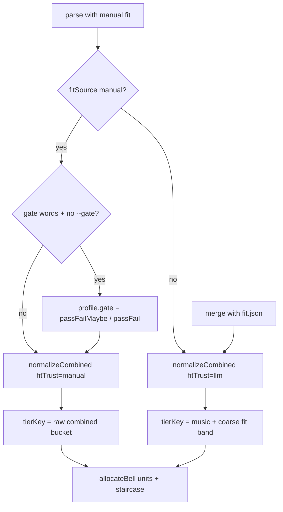

# Combined tier equality — fit trust modes

Manual owner-typed fit and LLM fit.json use different normalization and same-tier rules.

## Diagram

## Modes

| Mode       | Detection                              | Normalization                         | Same-tier key                                |
| ---------- | -------------------------------------- | ------------------------------------- | -------------------------------------------- |
| **manual** | Any `fitSource: manual` with fit score | Adaptive fit std floor (field spread) | Quantized **raw** weighted blend (0.5 steps) |
| **llm**    | fit.json merge, no manual numerics     | Fit std floor 14                      | `effectiveMusic \| coarseFit band`           |

Rank/sort uses normalized `combinedScore`. Manual mode buckets vote equality on the raw
blend so symmetric swaps (90/77 vs 77/90 → raw 83.5) stay tied.

## See also

- [`spec/point-allocation.md`](../point-allocation.md) — Same score = same tier
- [`scripts/score/merge.mjs`](../../scripts/score/merge.mjs) — `resolveFitTrust`, `normalizeCombined`
- [`scripts/score/allocate.mjs`](../../scripts/score/allocate.mjs) — `tierKey`, `describeTierGroup`
