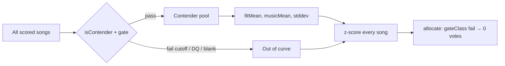

# Combined normalization — contender pool

When `normalizeCombined` builds the z-score curve for fit and music, **mean and stddev
are computed only from contenders** — songs that would actually compete for points.
Cutoff failures, disqualified songs, and blanks do not shape the curve.

Below-cutoff songs still receive a `combinedScore` (z-scored against contender stats)
for display, but the allocator gives them **0 votes** via the gate.

## Diagram

## Who is a contender?

`isContender(s, gate)` in [`scripts/score/merge.mjs`](../../scripts/score/merge.mjs):

| Excluded from curve                        | Included                      |
| ------------------------------------------ | ----------------------------- |
| `isDisqualified` (`-` in comment)          | Songs eligible to earn points |
| `needsUserInput` (blank / missing score)   |                               |
| Below `--cutoff` (e.g. `--cutoff fit:52`)  |                               |
| Gate `fail` (terrible-fit / explicit fail) |                               |

Example: `--cutoff fit:52` → only songs with fit ≥ 52 contribute to fit mean/stddev.
Sub-52 songs are scored on that remaining curve but excluded from vote allocation.

## Where this applies

| Path                                         | Status                                                                                                                                                             |
| -------------------------------------------- | ------------------------------------------------------------------------------------------------------------------------------------------------------------------ |
| `mergeFit` / LLM rounds (`merge-scores.mjs`) | **Shipped** — passes `profile.gate` into `normalizeCombined`                                                                                                       |
| Manual-fit parse (`applyManualFitScoring`)   | **Planned** — must pass `profile.gate` when wired to `normalizeCombined` ([combined-tier-trust-modes plan](../../.cursor/plans/combined-tier-trust-modes.plan.md)) |

## See also

- [`spec/point-allocation.md`](../point-allocation.md) — combined score and allocation
- [`spec/decisions.md`](../decisions.md) — 2026-06-16 (gated-out fit must not inflate fit std)
- [`scripts/score/gate.mjs`](../../scripts/score/gate.mjs) — `gateClass`, table visibility
