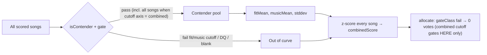

# Combined normalization — contender pool

When `normalizeCombined` builds the z-score curve for fit and music, **mean and stddev
are computed only from contenders** — songs that would actually compete for points.
Cutoff failures, disqualified songs, and blanks do not shape the curve.

Below-cutoff songs still receive a `combinedScore` (z-scored against contender stats)
for display, but the allocator gives them **0 votes** via the gate.

A **`combined`-axis cutoff is the exception**: it never leaves the curve (it *is* the
curve output, so filtering by it would be circular). It gates allocation only, leaving
every `combinedScore` unchanged. Only raw-axis (`fit` / `music`) cutoffs shrink the pool.

## Diagram

## Who is a contender?

`isContender(s, gate)` in [`scripts/score/merge.mjs`](../../scripts/score/merge.mjs):

| Excluded from curve                            | Included                                     |
| ---------------------------------------------- | -------------------------------------------- |
| `isDisqualified` (`-` in comment)              | Songs eligible to earn points                |
| `needsUserInput` (blank / missing score)       | **All songs when cutoff axis = `combined`**  |
| Below a `fit`/`music` `--cutoff` (e.g. `fit:52`) |                                            |
| Gate `fail` (terrible-fit / explicit fail)     |                                              |

Example: `--cutoff fit:52` → only songs with fit ≥ 52 contribute to fit mean/stddev.
Sub-52 songs are scored on that remaining curve but excluded from vote allocation.

A `--cutoff combined:76` does **not** shrink the pool — combined scores stay exactly
as they were, and the cutoff only zeroes votes for songs below 76 (reflowing the bank
upward). Filtering the pool by `combinedScore` would be circular, and collapses the
field enough to trip the small-N std floors and blow the z-scores up.

## Where this applies

| Path                                         | Status                                                                               |
| -------------------------------------------- | ------------------------------------------------------------------------------------ |
| `mergeFit` / LLM rounds (`merge-scores.mjs`) | **Shipped** — passes `profile.gate` into `normalizeCombined`                         |
| Manual-fit parse (`applyManualFitScoring`)   | **Shipped** — passes `profile.gate` into `normalizeCombined` with `fitTrust: manual` |

## See also

- [`spec/point-allocation.md`](../point-allocation.md) — combined score and allocation
- [`spec/decisions.md`](../decisions.md) — 2026-06-16 (gated-out fit must not inflate fit std)
- [`scripts/score/gate.mjs`](../../scripts/score/gate.mjs) — `gateClass`, table visibility
