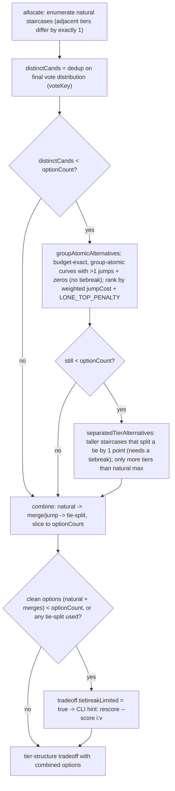

# Tier-structure menu — backfill order

How the point-split menu fills up to `optionCount` options (default 5), and when it
declares itself tiebreak-limited. Applies only when no curve is forced
(`--tier-count`/`--bucket-count` both unset — those force a single option A instead).

## Diagram

## Ordering rules

- **Backfill order is best-kind-first:** natural no-jump splits, then merge/jump curves
  (no tiebreak), then tie-split staircases (needs a tiebreak). Option A (the primary clean
  staircase) is never displaced.
- **Merge/jump ranking:** each jump costs `(gap − 1) × upperLevel ÷ scoreGap`, so a cheap
  bottom `2→0` beats a tall top `5→3`; a lone inflated top adds `LONE_TOP_PENALTY` to price
  out the "dump leftovers on #1" regression.
- **`--bucket-count K`** bypasses this menu: real k-means (`ckmeans1dWeighted`) into K
  clusters, then `bestMonotonicLevels` assigns a budget-exact monotonic value per cluster.
- **`tiebreakLimited`** is set when the clean options can't fill `optionCount`; the CLI then
  points at `rescore --score <i>:<v>` / `--fit-score` instead of silently emitting one option.

## See also

- [`spec/point-allocation.md`](../point-allocation.md) — _Backfilling the menu on flat fields_, _Manual score overrides_
- [`scripts/score/allocate.mjs`](../../scripts/score/allocate.mjs) — `groupAtomicAlternatives`, `separatedTierAlternatives`, `bestMonotonicLevels`, `tier-structure` menu block
- [`scripts/parse/cli-print.mjs`](../../scripts/parse/cli-print.mjs) — `tiebreakLimited` hint
