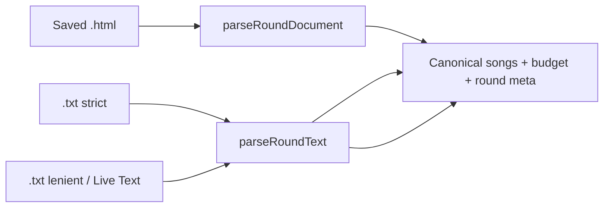

# Round Input Parsing

How saved Music League exports become the canonical song list consumed by scoring
and allocation. Parsing is **deterministic** — no LLM, no inference beyond documented
rules.

**Related:** [score-parsing.md](score-parsing.md) (comment tokens), [comments.md](comments.md)
(user vs submitter), [analysis-artifacts.md](analysis-artifacts.md) (output paths).

## Canonical song shape

Every parser path emits the same fields per song:

| Field | Source | Scoring? |
| --- | --- | --- |
| `rawOrderIndex` | `#` from export order (`song-N` id or text position) | join key |
| `title`, `artist`, `album` | metadata block | display only |
| `userComment` | your comment box (`data-comment` or recovered text) | **sole scoring input** |
| `submitterComment` | submitter quote (when shown) | **never** — context only |
| `userAllocatedVotes` | `data-weight` pre-allocation (HTML) | floor hint |
| `spotifyUri` | hidden `input[name="uri"]` (HTML) | enrichment only |
| `isOwn` | your submission (`mine: true` / own marker) | skipped entirely |

After `scoreComment`, each song also carries parsed signals (`score`, modifiers,
`fitScore`/`fitTier`/`gate`, flags). See [score-parsing.md](score-parsing.md).

### User vs submitter contract

**Only `userComment` is scored.** The submitter quote explains why they picked the
song; it must never change music/fit numbers, gates, or allocation. Preserve both
strings verbatim in outputs when practical.

## Input paths



| Path | Module | When |
| --- | --- | --- |
| HTML | `scripts/extract-html.mjs` | Saved round page (preferred) |
| Text strict | `scripts/parse-text.mjs` | Copy/paste with `Album art` blocks + `N/1000` footers |
| Text lenient | `scripts/parse-text.mjs` | Live Text / OCR paste (footers present, other anchors missing) |

`parse-round.mjs` chooses HTML when both `.html` and `.txt` exist under
`data/rounds/`. Pass `--lenient` to force the lenient text path.

Both extractors are **environment-agnostic** (native `DOMParser` in browser,
`linkedom` in Node) so the future web app reuses the same code.

## HTML extraction (`extract-html.mjs`)

### Selectors (confirmed)

| Data | Selector / attribute |
| --- | --- |
| Song nodes | `div.song[id^="song-"]` |
| Index | `id="song-N"` → `rawOrderIndex = N` |
| Title | `h6` text |
| Artist | `span.d-block.text-truncate` |
| Album | `span.text-body-secondary` |
| Own song | `x-data` contains `mine: true` → skip scoring, record in `ownSongs` |
| User comment | `data-comment` attribute |
| Pre-allocation | `data-weight` → `userAllocatedVotes` (null if absent) |
| Spotify URI | `input[name="uri"]` value |
| Submitter quote | `p` with `i.bi-quote`, only when `x-show="true"` |
| Budget | nearest ancestor `[x-data]` matching `upvoteBankSize` |
| Round prompt | `h5.card-title`, else `<title>` after `Music League \|` |
| Description | `p.card-text[data-description]` |

### Budget encoding

Music League sets `maxUpvotesPerSong: 0` for “no limit”. The parser converts **0 →
null** (unlimited) so the allocator never treats it as a literal cap of zero. Bank
sizes keep their numeric value — a 0 bank genuinely means no upvotes.

### View-Source recovery

When a zero-song parse finds entity-escaped round markup in `<td class="td1">`
cells (Cocoa HTML Writer paste), `recoverEscapedSource` rebuilds the HTML string.
See `spec/decisions.md` → 2026-06-11.

## Text extraction (`parse-text.mjs`)

### Strict path

Requires the structured copy/paste shape:

- `Album art` delimiter between songs
- `N / 1000` footer on each comment (character-length checksum)
- Standard placeholder: `What did you think of this song?`

Footer count must match the recovered user-comment line length; mismatch →
`needsReview` instead of guessing.

### Lenient path (Live Text / OCR)

Used when strict anchors are missing but **`N / 1000` footers survive** (typical of
iOS Live Text on round screenshots). See [Mobile capture](#mobile-capture-live-text)
below.

Behavior:

- Segment songs on `N / 1000` footers (also `4/1000` without spaces)
- Walk backward from each footer to recover title/artist/album/comment block
- Match placeholder loosely: `What did you think … this song?` (`about` vs `of`)
- Drop stitch-app trailers (`Screenshots Stitched`, `Available on the App Store`)
- Parse budget from noisy header lines (`00 OF 10 %` → bank size) — best-effort
- **Every lenient row** gets `needsReview` — structure cannot be fully trusted

Empty placeholder → `needsUserInput`. Regression fixture:
`tests/regressions/livetext-kpop-group.txt`.

## Modes

Passed to `scoreComment` as the second argument:

| Mode | CLI | Effect on words-only comments |
| --- | --- | --- |
| `objective` | default | disqualified |
| `subjective` | `--mode subjective` | `needsReview` |
| `thematic` | not CLI-exposed yet | `needsResearch` when music known, fit unknown |

Fit tier/gate vocabulary in comments requires `--fit-words` (or `{ fitWords: true }`
in library callers).

## Pipeline entry

```bash
just parse <round> [--mode objective|subjective] [--lenient] [--fit-words]
```

Writes `data/analysis/<round>/music.json` + `music.md`. Re-parse only when
replacing the HTML/text export; pick/merge/rescore never re-read the raw file.

When `fit.json` exists and merge-stage flags (`--weights`, `--rank`, `--gate`,
`--cutoff`) are passed on parse, the command chains `mergeFitJson` and prints the
full explore tables (same as merge/rescore).

## Mobile capture (Live Text)

Music League’s third-party login often opens rounds in an **in-app browser** where
page text cannot be selected. The supported mobile workflow:

1. **Screenshot** the round page in the Music League app (scroll through all songs;
   take multiple shots if needed).
2. **Live Text** — in Photos, tap the text-selection control on each screenshot and
   **Select All**, then Copy. (Optional: use a stitch app to combine shots first;
   the parser drops `Screenshots Stitched` / App Store trailers.)
3. **Paste** the raw text into the web app textarea or save as
   `data/rounds/<round>.txt`.
4. Run **`just parse <round> --lenient`** (or let auto-detect pick lenient when
   footers exist without `Album art` blocks).

Verify flagged rows (`needsReview`) against the screenshots before committing
votes. Prefer saving the full `.html` export on desktop when possible.

## Tests

| File | Covers |
| --- | --- |
| `tests/extract-html.test.mjs` | HTML selectors, own-skip, budget |
| `tests/parse-text.test.mjs` | Lenient footer anchor, placeholder, year scores |
| `tests/regressions/livetext-kpop-group.txt` | Live Text K-pop fixture |
